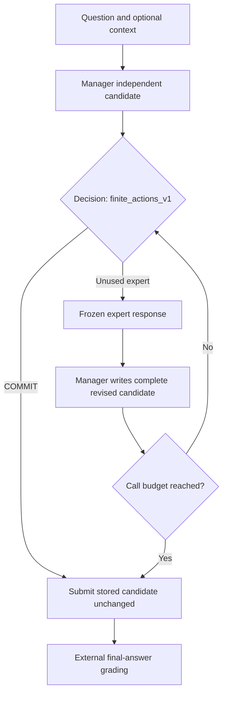
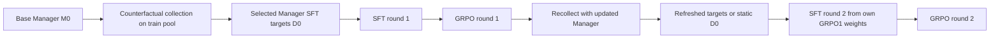

# MARGENT Architecture

MARGENT learns when to commit to a stored solution and when to request specialist help. The current free-response math experiment trains three experts first, freezes them, and updates a separate Manager through repeated collection, SFT and GRPO.

For installation and executable commands, use the **[complete experiment runbook](docs/MARGENT_END_TO_END_RUNBOOK.md)**. This page describes the implementation and its boundaries; the [repository homepage](../README.md) provides the short project overview.

## 1. Components and parameter ownership

| Component | Responsibility | Trainable parameters |
|---|---|---|
| Extractor | Extract givens, variables, constraints and useful formulations | Independent expert LoRA during expert SFT only |
| Reasoner | Develop an approach and intermediate mathematical deductions | Separate expert LoRA during expert SFT only |
| Verifier | Audit the stored derivation using Verdict / Evidence / Correction | Separate expert LoRA during expert SFT only |
| Manager | Produce an independent solution, choose COMMIT or an unused expert, revise after advice | Its own LoRA during Manager SFT/GRPO |
| Environment and grader | Bind candidates to calls, enforce the protocol and grade final answers | None |

All roles initialize from the same pinned `Qwen/Qwen3.5-9B` base revision. The experts do not train sequentially into one shared adapter. Their serving process loads one frozen base and switches among three independently trained role adapters. The Manager is a separate model instance and does not initialize from an expert adapter.

The RunPod layout uses GPU 0 for the frozen expert service and GPU 1 for Manager work. Expert training and expert dev comparison run before that persistent service starts. Hardware requirements, checks and resource budgets are in the runbook.

## 2. Inference protocol

1. The Manager first writes an independent solution ending in `FINAL_ANSWER: \boxed{...}`.
2. At a decision turn it emits exactly `COMMIT` or one expert tool call with empty arguments. `finite_actions_v1` constrains legal action syntax and prevents repeated expert use; it does not inspect answer keys or choose the best action.
3. `COMMIT` submits the stored candidate unchanged. A decision turn cannot secretly replace the answer.
4. The environment provides the actual stored derivation to Verifier; the Manager cannot pass a different candidate through tool arguments. Extractor and Reasoner receive the question/context under their role contracts.
5. After an expert response, the Manager writes a complete self-contained revision. Only the revision phase changes the candidate. The current pilot allows at most two calls, with each role used at most once.
6. At the call limit the environment submits the current candidate. The external grader checks answer correctness and protocol validity. Expert self-reported judgments are never ground-truth rewards.

Runtime prompts allowlist question/context rather than exposing labels or source solutions. Experts are fallible models and their mathematical advice may include solution content. The historical structured/MCQ rule that specialists provide signals under a different answer-disclosure contract is not the math protocol.

## 3. Expert data and training

The [published dataset card](data/math_luna_codex_pilot_20260929/README.md) is the source of truth for counts, file formats and provenance. The retained expert pool has 104 train and 32 dev questions, isolated from the complete Manager and external test pools. Each question provides one Extractor target, one Reasoner target and two Verifier candidate audits: 544 supervised rows in total.

Questions come from NuminaMath-1.5. The role targets were generated through Codex subagents with selected model `gpt-6-luna`; independently unobserved backend identity, token usage and sampling parameters remain unknown. Teacher request/response evidence is retained. A mechanical encoding filter removed whole questions consistently across roles; this is not correctness-based selection.

Each role receives assistant-only supervised loss in its own LoRA. The controller validates data/provenance, freezes a local data copy, trains all roles, reloads/switches adapters and exports `experts.json` plus a Manager configuration binding that bundle. A separate dev comparison evaluates prompt-only versus trained experts. Verifier label agreement is teacher agreement, not an independent quality certificate. All published synthetic labels remain `reviewed=false` until reviewed.

The expert bundle is frozen throughout Manager RSI. Jointly evolving experts and Manager is not implemented by this experiment.

## 4. Manager cold start and iterative data flow

Manager training uses a separate frozen Numina pool, not the expert teacher targets. The default pilot selects 16 train / 16 dev from its available 128/64 pool by normalized-question hash. Test data is checked for isolation but never used for training targets or checkpoint selection.

For each training question, counterfactual collection evaluates direct commitment and non-repeating expert sequences up to depth two. The external grader identifies successful outcomes. The main selector favors direct commitment when already correct, otherwise shortest successful routes. It writes Manager assistant messages into `sft.jsonl`; expert replies and prompt history remain context with no supervised loss. Configured question-only distillation adds successful solutions as additional Manager targets.

For a candidate state s and expert action a, the mechanism compares final correctness after expert advice and Manager revision against committing s unchanged. This is a paired result under the fixed decoding setup, not an unbiased estimate over all possible generations. Recollection asks whether that value and the useful route change as Manager weights change.

### Experimental arms

| Arm | SFT targets after the first round | Purpose |
|---|---|---|
| dynamic | Refresh counterfactual trees with the updated Manager and reselect direct/shortest-success routes | Test refreshed experience |
| static | Reuse the original selected targets; collect a shadow tree for diagnostics only | Control for refreshing SFT experience |
| success | Select successful trajectories from the current tree after matching coverage and commit/rescue mixture | Compare shortest-route selection with ordinary successful-route distillation |

All arms share the initial tree and nominal question, depth, seed and update budgets. Static still runs on-policy GRPO; it does not freeze all learning experience. Its shadow collection cost is retained, so report actual execution cost separately from the cost a deployed static variant could save. Matched update counts do not imply identical tokens or FLOPs.

Round-two SFT initializes from the same arm's round-one GRPO weights and creates a new optimizer. Resuming an interrupted stage instead restores saved stage state. The controller uses a shared initial assessment/collection, per-arm two-round training/dev stages, recollection and success selection: 31 stages in the default plan.

## 5. Optimization and evaluation contracts

### SFT

Only Manager assistant targets receive loss. Role messages and expert responses remain conditioning context. Model/template/configuration identities and dataset fingerprints bind a run to its inputs. Checkpoint inheritance is explicit; a later round does not silently reset to base.

### GRPO

A question group shares one independently generated draft and samples four decision/revision trajectories. The initial draft and expert replies have no RL gradient. Reward is binary valid terminal correctness: correct and protocol-valid = 1, otherwise 0. There is no call penalty or Verifier-verdict reward.

Group-relative advantages, clipped policy ratios and a KL term compare the policy to that round's fixed SFT reference. Sampling and scoring use compatible temperature/action support. Constant-reward groups have zero outcome advantage; the KL term can still contribute when applicable. `completed_groups` and `optimizer_steps` are distinct: a group without sampled Manager tokens need not produce an optimizer update.

The default pilot uses eight question groups per GRPO stage. It takes the first eight questions of the deterministic shuffled train16 pool and reuses that seeded ordering in later stages; it does not automatically cover the complete pool. The initial rescue/commit and mixed-reward stage gates are specified in the runbook.

### Independent evaluation

Each question records both the Manager's independent answer and the final tool-assisted policy answer. Report independent/policy correctness, n, validity/truncation, call counts, rescues and harms. Within-checkpoint policy-minus-independent gain is different from independent-accuracy growth across checkpoints.

AIME2026 (30 questions) is the only held-out test; BeyondAIME (100 questions) is split into Manager RSI train/dev data (`data/manager_beyond_rsi_20260930`) and is never reported as held-out. Freeze comparisons before seeing test scores. The default matrix compares M0 with each final round_2/grpo Manager using the same frozen experts and budgets (`scripts/evaluate_aime_matrix.sh`). A second-round SFT checkpoint has prior GRPO ancestry and is not a pure SFT baseline.

## 6. Execution, persistence and observability

Controllers record configuration, data, code/harness, checkpoint and advisor identities. Local stage records include status, summaries, events, generations, usage and errors. Collection/evaluation preserve per-question shards. SFT uses Trainer checkpoints; GRPO commits adapter/optimizer/step state atomically and resumes from the recorded committed step.

Budgets persist across restart. The expert controller, Manager controller and optional AIME controller have different completion markers. A Finished W&B child does not prove parent completion or full benchmark coverage. Use `experts_complete`, `pilot_complete`, `baseline_complete`, evaluation counts and real artifacts as documented in the runbook.

W&B mirrors measurements and selected evidence, while local files retain full operational detail. Evidence artifacts have allowlists and size limits; they do not automatically back up model weights or complete optimizer state. Incomplete usage accounting supports a lower bound, not a zero-cost claim. The current Manager controller lacks a directory concurrency lock, so run only one controller per output directory.

## 7. Source map

All paths below are relative to `agent_routing/`.

| Layer | Entry points | Responsibility |
|---|---|---|
| Runtime configuration | [math_rsi_actions.json](configs/math_rsi_actions.json), [expert config](data/math_luna_codex_pilot_20260929/configs/expert_sft_text_clean.json) | Pinned model and experiment defaults |
| Data normalization/isolation | [data.py](src/verifiable/data.py), [expert_data.py](src/verifiable/expert_data.py), [expert_isolation.py](src/verifiable/expert_isolation.py) | Splits, hashes, exclusions and expert/Manager separation |
| Teacher workflow | [expert_synthesis.py](src/verifiable/expert_synthesis.py) | Export, generation/import and provenance for role targets |
| Expert training/service | [experts.py](src/verifiable/experts.py), [expert_train.py](src/verifiable/expert_train.py), [expert_eval.py](src/verifiable/expert_eval.py) | Controller, role LoRAs, bundle/reload, serving and dev comparison |
| Math protocol | [protocol.py](src/verifiable/protocol.py), [actions.py](src/verifiable/actions.py), [chat_template.jinja](src/verifiable/chat_template.jinja) | Runtime prompts, immutable COMMIT, finite actions and template |
| Inference and grading | [backend.py](src/verifiable/backend.py), [answers.py](src/verifiable/answers.py) | Generation/model loading, final-answer parsing and grading |
| Counterfactual targets | [experiment.py](src/verifiable/experiment.py) | Candidate trees, branch selection and Manager SFT targets |
| Manager SFT/GRPO | [training.py](src/verifiable/training.py), [rsi_grpo.py](src/verifiable/rsi_grpo.py) | Assistant-token SFT and rollout-based optimization |
| RSI planning/control | [rsi.py](src/verifiable/rsi.py) | Three-arm plans, stages, budgets, gates and timeline |
| Stage evaluation | [runner.py](src/verifiable/runner.py), [analysis.py](src/verifiable/analysis.py) | Collection/assessment/evaluation records and diagnostics |
| Evidence | [provenance.py](src/verifiable/provenance.py), [telemetry.py](src/verifiable/telemetry.py), [wandb_tracking.py](src/verifiable/wandb_tracking.py) | Identity, heartbeats, local logging, W&B tables/artifacts |
| RunPod wrappers | [expert SFT](scripts/runpod_expert_sft.sh), [RSI pilot](scripts/runpod_rsi_pilot.sh), [AIME controller](scripts/runpod_aime_baseline.py) | Operational entry points used by the runbook |
| Validation | [tests/](tests/) | Data, protocol, reward, resume, reporting and optional CPU integration checks |

`src.verifiable.rsi` is the current math SFT/GRPO controller. Historical `src.verifiable loop` is SFT-only; the old `rl` entry point is disabled for this protocol. Historical `evaluate-suite` / `paper-check` expects `loop.json` and is not the current RSI matrix exporter.

## 8. Historical benchmark modules

The repository retains a separate structured/MCQ workflow:

| Module | Role |
|---|---|
| `src/benchmarks/` | Benchmark loaders and normalized data contracts |
| `src/subagents/` | Structured advisor schemas, prompts and local/remote clients |
| `src/teachers/` | Teacher providers for structured synthesis |
| `src/manager/` | Structured Manager prompting/training/evaluation |
| `src/pipeline/` | Historical benchmark CLI orchestration |
| `src/utils/` | Shared helpers |

Structured teacher prompts live in `src/subagents/prompts/{extractor,reasoner,verifier}.py`; shared structured runtime prompts are in `runtime_prompts.py`. Free-response math uses `src/verifiable/protocol.py` instead. Stored teacher requests replay their original prompts; changing prompt code does not rewrite existing datasets/adapters or migrate old runs. Record prompt/source versions and use new experiment directories after changes.

Historical instructions, preserved for their own domains:

- [Benchmark walkthrough](docs/legacy/BENCHMARK_RUNBOOK.md): MedQA, LegalBench, MMLU-Pro and GPQA.
- [AQuA-RAT / ARC-Challenge](AQUA_ARC_BENCHMARKS.md).
- [MCQ marginal-value protocol](MARGINAL_VALUE_EXPERIMENTS.md).
- [SFT replay / routing-anchor experiments](SFT_RL_ROUTING_EXPERIMENTS.md).
- [Historical ADC plan](EXPERIMENTS.md), [earlier model-size plan](EXPERIMENTS_LEGACY.md), [historical paper-readiness notes](PAPER_READINESS.md).

These documents do not override the current math runbook. Old run artifacts under `outputs/` and paper-figure source materials remain preserved for traceability.

## 9. Research and validation boundaries

Here RSI means a bounded loop in which updated Manager parameters generate the next round's experience under a fixed training program. It does not mean autonomous algorithm invention or demonstrated recursive acceleration.

The intended questions are whether refreshed targets improve on static ones, whether useful advice becomes independent held-out capability, and whether delegation remains selective at comparable accuracy. Answering them requires full independent tests, paired question analysis, multiple training seeds and disclosed costs. Passing CPU protocol/resume tests, a smoke run or a lower SFT loss does not answer those research questions or establish 9B CUDA throughput.
