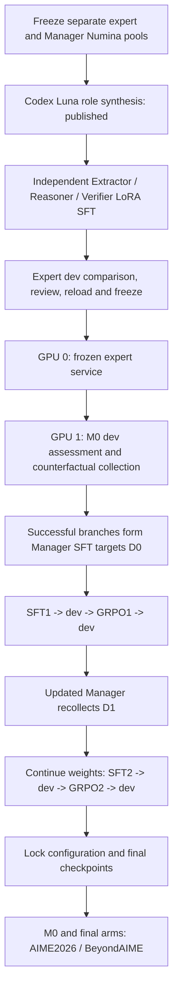

# MARGENT Math Experiments: Complete RunPod Runbook

Updated: 2026-09-30. Runtime baseline: main commit `17c5da8e0cbe4c0e672208816c9a76f7c7a9f1b2`, including the published Luna data. Subsequent documentation commits do not change the training algorithm. The commands below are intended for execution on RunPod.

**Fork note (Candy26i/9.30):** this repository changes the `finite_actions_v1` decision grammar so every Manager SFT decision target is a legal action, while the compact call form shown in the system prompt stays legal. Use this repository's commit instead of `17c5da8` and adjust the section 3 clone command accordingly. Decision/policy results produced with earlier code, including any early M0 AIME baseline, are not comparable with runs on this code, and `harness_identity` refuses to resume them. `doctor` (section 7) now also checks the grammar against the real tokenizer.

**Fork note: Manager RSI on BeyondAIME.** The experts still train on the Numina Luna data and stay bound to the original `manager/` pool. Manager RSI (collection, SFT, GRPO and the dev assessments inside RSI) now runs on `data/manager_beyond_rsi_20260930/`: the 100 BeyondAIME questions split 64 train / 36 dev by `scripts/build_beyond_rsi_pool.py`, with AIME2026 as the **only** held-out test. BeyondAIME numbers are train/dev results and must never be reported as held-out. Run the M0 probe in section 8.0 before any RSI launch, and use `scripts/evaluate_aime_matrix.sh` / `scripts/verify_aime_matrix.py` for section 10. Where older text below mentions the Numina Manager pool or a BeyondAIME test cell, these notes take precedence.

**Follow sections 3–10 for a first run; use section 11 for monitoring and section 12 for recovery.** The default is a small mechanism pilot, not a final paper-scale experiment. Start every new terminal with the environment file in section 3. Use fresh experiment directories instead of reusing failed runs or historical default paths.

- [Architecture and source map](../README.md)
- [Published dataset and provenance](../data/math_luna_codex_pilot_20260929/README.md)
- [RunPod setup](#3-runpod-hardware-and-shared-environment)
- [Expert SFT](#5-train-the-three-subagents)
- [Manager RSI](#8-run-the-manager-rsi-pilot)
- [External evaluation](#10-independent-benchmarks)
- [W&B monitoring](#11-monitoring-with-wb)
- [Recovery](#12-interruption-and-recovery)

## 1. Workflow and training targets



All four roles use `Qwen/Qwen3.5-9B`, pinned to revision `c202236235762e1c871ad0ccb60c8ee5ba337b9a`.

| Component | Initialization and supervision | Updates |
|---|---|---|
| Extractor | Base + independent LoRA; conditions, variables, constraints, goals | Role SFT, then frozen |
| Reasoner | Base + separate LoRA; mathematical derivations | Role SFT, then frozen |
| Verifier | Base + separate LoRA; candidate audit with Verdict / Evidence / Correction | Role SFT, then frozen; its verdict is not the Manager reward |
| Manager | Independent base M0 + its own LoRA; independent solution, CALL/COMMIT, post-call revision | SFT and GRPO each round; no expert adapter initialization |
| External answer grader | Fixed final-answer parsing and mathematical equivalence checks | Never trained; used for branch selection, reward and accuracy |

Each expert initializes independently from the pinned base. At serving time, one frozen base hosts three role adapters. The Manager runs as a separate model instance on the other GPU.

**The Manager's first SFT dataset is not the 544 expert teacher examples.** M0 first solves the Manager train questions independently, then explores non-repeating expert calls up to depth 2: three single-call and six two-call branches. The external grader checks final answers. Directly correct solutions and shortest successful routes produce `initial_collection/sft.jsonl`. Only Manager assistant outputs receive supervised loss; questions, history and expert replies are context. With `distill_solutions=true`, successful solutions also supply question-only distillation targets. Collection must finish before the first Manager SFT can start.

## 2. Data, default scale and evidence boundaries

Use the published [`data/math_luna_codex_pilot_20260929/`](../data/math_luna_codex_pilot_20260929/) bundle.

| Dataset | Train | Dev / test | Purpose |
|---|---:|---:|---|
| Unique expert Numina questions | 104 | 32 dev | Checked for overlap against the complete Manager and external test pools |
| Extractor examples | 104 | 32 | 136 rows |
| Reasoner examples | 104 | 32 | 136 rows |
| Verifier examples | 208 | 64 | Two candidate audits per question; 272 rows |
| Frozen Manager Numina pool | 128 | 64 dev | Separate pool; this pilot selects 16 / 16 by question hash |
| AIME2026 | None | 30 test | Independent external evaluation of M0 and trained Managers |
| BeyondAIME | None | 100 test | Second external evaluation after configuration is locked |

The expert bundle contains **136 questions and 544 role examples: 416 train + 128 dev**. The original 160-question generation completed 960 tasks. A mechanical control-character filter excluded 24 train questions and their 96 supervised rows; retained content was not rewritten. Two Verifier candidates are not two independent questions.

- Questions come from pinned NuminaMath-1.5. Role targets use **Codex subagent synthesis, selected model gpt-6-luna**. RunPod does not regenerate them. Actual backend model version, token usage and sampling settings were not independently observed and remain null.
- The repository trainer reads JSONL in `sft/`. The six arrays in `json/` preserve equivalent messages for other frameworks. Do not point `EXPERT_DATA` at `json/`.
- `manager/` contains train/dev/test files and a manifest. AIME remains test-only in this experiment even though its upstream split is named train. Never use it for collection, SFT or GRPO.
- All expert labels have `reviewed=false`. A heuristic flags 15 Reasoner rows as potentially incomplete derivations; this is not a verified error count. The bundle supports an engineering pilot, not a claim of certified label quality.
- Data validation and environment checks do not establish successful 9B CUDA training. Actual expert training and final benchmark results must still be measured. Historical smoke tests and failed baselines are separate evidence.

| Stage | Fixed default scale | Budget |
|---|---|---|
| Expert training | Three roles, 16 optimizer steps each; batch 1, accumulation 8, lr 2e-5, rank 16, alpha 32, dropout .05, BF16, sequence 8192 | 120 minutes for the entire expert controller; restarting preserves its deadline |
| Expert dev comparison | Base vs SFT; E/R 32 rows each, V 64; max tokens 512, context 16384 | Separate persistent 120-minute budget |
| Manager pilot | 16 train / 16 dev; dynamic/static/success, two rounds each | At most 24 hours shared by all arms and stages |
| Manager SFT per round | 8 optimizer updates; batch 1, accumulation 2, lr 2e-5, rank 16 | Included in the 24-hour budget |
| Manager GRPO per round | 8 question groups × 4 rollouts; lr 1e-6, temperature .8, clip .2, KL beta .01 | Included above; completed groups and optimizer updates are separate counters |
| External test | M0 + three round_2/grpo models; AIME 30 and BeyondAIME 100 each | Section 10 allocates 120 minutes per model/benchmark cell; completion is not guaranteed |

Manager collection/evaluation temperature is 0. Independent solution and revision each allow 2048 tokens; decision allows 128; advisor allows 2048; context/SFT sequence limit is 32768. Maximum call depth is 2 with `finite_actions_v1` decisions. These values come from `configs/math_rsi_actions.json`, the template used to generate `manager_config.json`. Changed settings require a new configuration, directory and comparable baseline.

## 3. RunPod hardware and shared environment

Expert SFT runs sequentially on one free GPU. Plan the full Manager/advisor workflow for **two 80GB GPUs**: GPU 0 serves experts, GPU 1 runs the Manager, each in a single process. Do not use `torchrun`. This is a hardware recommendation, not a measured memory guarantee. The expert entry point checks exactly one visible CUDA device, BF16 support and at least 40 GiB free memory. Reserve disk space for the base, resumable checkpoints, all arm/round adapters and question logs.

Use a CUDA PyTorch RunPod image; the original environment used torch 2.8.0. The clone destination must be unused:

```bash
cd /workspace
git clone --branch main https://github.com/Jeremyyny/7.98.git /workspace/7.98
cd /workspace/7.98/agent_routing
git checkout --detach 17c5da8e0cbe4c0e672208816c9a76f7c7a9f1b2
git rev-parse HEAD
nvidia-smi
command -v tmux
command -v timeout
command -v flock
```


If `tmux`, GNU `timeout` or `flock` is missing, install them on a Debian/Ubuntu Pod with system installation privileges:

```bash
apt-get update
apt-get install -y tmux coreutils util-linux
```


Create the shared environment file. `01` identifies a new experiment. If these paths already belong to another run, change all related paths and session names together.

```bash
cat > /workspace/margent-luna-env.sh <<'EOF'
export MARGENT_CODE=/workspace/7.98/agent_routing
export MARGENT_VENV=/workspace/margent-venv
export MARGENT_RUN_ROOT=/workspace/margent-luna-setup-01
export HF_HOME=/workspace/hf-cache
export HF_HUB_CACHE=/workspace/hf-cache/hub
export HF_DATASETS_CACHE=/workspace/hf-cache/datasets
export HF_HUB_DISABLE_XET=1
export TMPDIR=/workspace/margent-tmp
export PYTHONUNBUFFERED=1
export EXPERT_PYTHON=/workspace/margent-venv/bin/python
export LUNA_DATA=/workspace/7.98/agent_routing/data/math_luna_codex_pilot_20260929
export EXPERT_CONFIG="$LUNA_DATA/configs/expert_sft_text_clean.json"
export EXPERT_DATA="$LUNA_DATA/sft"
export EXPERT_MANAGER_DATA="$LUNA_DATA/manager"
export EXPERT_ROOT=/workspace/margent-luna-experts-01
export EXPERT_SESSION=margent-luna-experts-01
export EXPERT_GPU=0
export RSI_PYTHON="$EXPERT_PYTHON"
export RSI_EXPERT_ROOT="$EXPERT_ROOT"
export RSI_CONFIG="$EXPERT_ROOT/manager_config.json"
export RSI_DATA="$MARGENT_CODE/data/manager_beyond_rsi_20260930"
export RSI_TRAIN_N=16
export RSI_DEV_N=16
export RSI_ARMS="dynamic static success"
export RSI_HOURS=24
export RSI_SUBSET=/workspace/margent-luna-beyond-subset-16-16-01
export RSI_OUTPUT=/workspace/margent-luna-beyond-rsi-01
export RSI_ADVISOR_GPU=0
export RSI_MANAGER_GPU=1
export EVAL_ROOT=/workspace/margent-luna-aime-tests-01
export WANDB_ENTITY=yuningyangaillm
export WANDB_PROJECT=MATH_rsi
export MARGENT_WANDB_MODE=online
export MARGENT_WANDB_TEXT=1
EOF
source /workspace/margent-luna-env.sh
mkdir -p "$TMPDIR" "$MARGENT_RUN_ROOT"
cd "$MARGENT_CODE"
bash scripts/runpod_math_setup.sh
"$EXPERT_PYTHON" -m pip check
```


Setup inherits the image's CUDA torch rather than reinstalling it. It installs `requirements-math.txt`, including Transformers 5.3.0, TRL 0.29.0, PEFT 0.18.1 and W&B 0.30.0, runs the listed tests, and saves `environment.lock.txt` / `nvidia-smi.txt`. A compatible existing venv can be reused. Keep dependencies and source fixed during an experiment.

Start each new terminal with:

```bash
source /workspace/margent-luna-env.sh
cd "$MARGENT_CODE"
```


## 4. Validate data, download the model and check W&B

This validation does not load the 9B model, call a teacher or train:

```bash
"$EXPERT_PYTHON" "$LUNA_DATA/validate_data.py"
```


Expect `valid=true`, `sft_rows=544`, 104 train / 32 dev questions, equivalent JSON exports and passing isolation checks. Keep the retained count at 104; do not restore the old 128 merely to satisfy a check. Use the complete `manager/` exclusion pool, not the 16-question subset.

Download the pinned base into the shared cache **before** starting the training timer:

```bash
"$EXPERT_PYTHON" - <<'PY'
from huggingface_hub import snapshot_download
snapshot_download("Qwen/Qwen3.5-9B", revision="c202236235762e1c871ad0ccb60c8ee5ba337b9a")
PY
```


Reuse your W&B login on the Pod. If needed, log in interactively; never place a key in GitHub, the environment file, chat or logs:

```bash
"$EXPERT_PYTHON" -m wandb login
"$EXPERT_PYTHON" -m src.verifiable wandb-check --out /workspace/margent-luna-wandb-check-01
cat /workspace/margent-luna-wandb-check-01/wandb_link.json
```


Open the returned URL. Confirm the project, job_type `tracking_check`, and `check/logging_check`. This verifies tracking only. An already authenticated user can start with `wandb-check`. Sample text and error logs are uploaded by default; `MARGENT_WANDB_TEXT=0` disables text and reduces debugging/audit evidence.

## 5. Train the three subagents

```bash
bash scripts/runpod_expert_sft.sh plan
bash scripts/runpod_expert_sft.sh start --minutes 120
bash scripts/runpod_expert_sft.sh status
tail -n 60 "$EXPERT_ROOT.log"
```


`plan` displays commands; section 4 performs the actual data validation. `start` creates its own tmux session. The sequence is data validation → frozen data copy → GPU memory check → Extractor SFT → Reasoner SFT → Verifier SFT → `experts.json` → actual adapter reload/switch verification → Manager configuration and completion report. The existence of `experts.json` alone does not establish reload success. This entry point does not launch Manager training or AIME.

```bash
tmux attach -t "$EXPERT_SESSION"
```


Detach with **Ctrl+B, then D** to leave training running. Ctrl+C interrupts the process.

After completion, inspect:

```bash
"$EXPERT_PYTHON" -m json.tool "$EXPERT_ROOT/expert_report.json"
"$EXPERT_PYTHON" -m json.tool "$EXPERT_ROOT/experts.json"
"$EXPERT_PYTHON" -m json.tool "$EXPERT_ROOT/manager_config.json"
```


Expected artifacts:

```text
/workspace/margent-luna-experts-01/
  expert_run.json                 Data/config/code and run settings
  budget.json                     Original deadline
  data/                          Frozen training data copy
  training/extractor/            Independent LoRA and Trainer checkpoints
  training/reasoner/
  training/verifier/
  experts.json                   Adapter paths and fingerprints
  manager_config.json            Manager config with expert/isolation binding
  expert_report.json             Completion and reload results
  logs/                          Stage logs
```

Completion requires `experts_complete=true`, all three roles reaching 16 optimizer steps, valid adapters/fingerprints, and successful reload/switch checks. One Finished `expert_sft` child is not completion of the expert bundle.

## 6. Compare expert dev outputs and review quality

Run this **before** starting the persistent advisor service; it also needs GPU 0. Compare prompt-only and trained-role outputs from the same base:

```bash
tmux new-session -d -s margent-luna-expert-dev-01 \
  bash -lc 'set -e; source /workspace/margent-luna-env.sh; cd "$MARGENT_CODE"; CUDA_VISIBLE_DEVICES="$EXPERT_GPU" "$EXPERT_PYTHON" -m src.verifiable.expert_eval --bundle "$EXPERT_ROOT/experts.json" --data-dir "$EXPERT_ROOT/data" --out "$EXPERT_ROOT/dev_comparison" --limit 64 --max-tokens 512 --max-context 16384 --minutes 120 > "$EXPERT_ROOT.dev-comparison.log" 2>&1'
tail -n 60 "$EXPERT_ROOT.dev-comparison.log"
```


`--limit 64` means up to 64 rows **per role**: E/R have 32 each, V has 64. Across both conditions, full dev coverage requires 256 generations. Inspect `evaluation_complete`, `expected_generations`, `completed_generations` in `dev_comparison/report.json` and paired outputs in `review.jsonl`. A limit of 32 produces only 192 generations and misses half of Verifier dev. Smaller diagnostics require a declared scope and fresh directory.

Review whether Extractor faithfully identifies conditions, Reasoner gives complete correct derivations, and Verifier identifies errors with justified corrections. Automated Verifier scores measure **agreement with teacher labels**, not independent correctness. Extractor/Reasoner quality is not automatically certified. Record the review before using this expert version in the main experiment; lower dev loss alone does not prove a better expert.

Budget exhaustion can leave W&B showing Finished while `controller_status=budget_exhausted` and `evaluation_complete=false`. Use semantic completion fields. Resume the same command/directory only while budget remains; an exhausted run stays incomplete. Changed limits, generation lengths or bundles require a new directory.

## 7. Serve the frozen experts

Once expert training/dev has ended and GPU 0 is free:

```bash
test -f "$EXPERT_ROOT/experts.json"
test -f "$RSI_CONFIG"
tmux new-session -d -s margent-luna-advisor-01 \
  bash -lc 'set -e; source /workspace/margent-luna-env.sh; cd "$MARGENT_CODE"; bash scripts/runpod_rsi_pilot.sh advisor > "$EXPERT_ROOT.advisor.log" 2>&1'
tail -n 60 "$EXPERT_ROOT.advisor.log"
curl -fsS http://127.0.0.1:8001/health
```


Wait for ready health and compare the returned identity/fingerprint with `experts.json`. This uses `src.verifiable.experts serve --config "$RSI_CONFIG"`; do not substitute the historical prompt-only server. If port 8001 or the session name is occupied, identify its owner before proceeding.

Check the API, template and service on the Manager GPU:

```bash
CUDA_VISIBLE_DEVICES="$RSI_MANAGER_GPU" "$RSI_PYTHON" -m src.verifiable doctor \
  --config "$RSI_CONFIG" --out /workspace/margent-luna-doctor-01.json
```


`doctor` is not a full training test. The historical `runpod_rsi_smoke.py` starts its own prompt-only advisor and does not validate this trained-expert combination. Verify that combination through the actual pilot stages and reload results.

## 8. Run the Manager RSI pilot

### 8.0 M0 feasibility probe on the BeyondAIME train subset

BeyondAIME is much harder than Numina, and the Manager decodes non-thinking with a 2048-token cap; truncated answers are invalid. Measure before spending the persistent 24-hour budget. With the advisor serving (section 7) and GPU 1 free:

```bash
export PROBE=/workspace/margent-luna-beyond-m0-probe-01
bash scripts/runpod_rsi_pilot.sh plan > /workspace/margent-luna-beyond-plan-01.txt
"$RSI_PYTHON" scripts/probe_m0_subset.py prepare --subset "$RSI_SUBSET" --out "$PROBE"
CUDA_VISIBLE_DEVICES="$RSI_MANAGER_GPU" "$RSI_PYTHON" -u -m src.verifiable.rsi stage assess \
  --config "$RSI_CONFIG" --checkpoint Qwen/Qwen3.5-9B \
  --data "$PROBE/train_as_dev.jsonl" --out "$PROBE/train" > "$PROBE/train.log" 2>&1
"$RSI_PYTHON" scripts/probe_m0_subset.py summarize --subset "$RSI_SUBSET" --out "$PROBE" --config "$RSI_CONFIG"
```

The probe runs M0 on exactly the train questions that `initial_collection` will use, so `independent_correct_n` is the gate's commit count. It also reports truncation, output length, real tokens/s and how many of GRPO's fixed `rl_max_steps` questions M0 can solve at all. Decide train size, arms, hours and token budget from these numbers **before** the RSI launch and before any AIME2026 evaluation; never calibrate on AIME2026. A changed setting needs a new `RSI_SUBSET`/`RSI_OUTPUT` (and, for `max_new_tokens`, a copied config).

### 8.1 Prepare the 16 / 16 subset and inspect the plan

The shared environment sets `RSI_DATA` to the BeyondAIME pool, and `RSI_TRAIN_N`, `RSI_DEV_N`, `RSI_ARMS` and `RSI_HOURS` override the wrapper's defaults (16, 16, all three arms, 24).

```bash
bash scripts/runpod_rsi_pilot.sh plan > /workspace/margent-luna-manager-plan-01.txt
cat /workspace/margent-luna-manager-plan-01.txt
"$RSI_PYTHON" -m json.tool "$RSI_SUBSET/pilot_data.json"
```


The plan selects 16 train / 16 dev questions from the frozen 128/64 pool in normalized-question-hash order. It prints 31 stages: shared initial_dev and initial_collection; two rounds of SFT/dev/GRPO/dev per arm; round-two recollection per arm; and selection in each success-arm round. Preparation reads the complete source manifest, including test files, to verify hashes/isolation. It does not run inference, create labels or train on external tests.

### 8.2 Start one controller

```bash
tmux new-session -d -s margent-luna-manager-01 \
  bash -lc 'set -e; source /workspace/margent-luna-env.sh; cd "$MARGENT_CODE"; bash scripts/runpod_rsi_pilot.sh run >> "$RSI_OUTPUT.controller.log" 2>&1'
tail -n 80 "$RSI_OUTPUT.controller.log"
bash scripts/runpod_rsi_pilot.sh report
```


The report may be unavailable until `rsi_run.json` exists. The persistent 24-hour deadline includes initial assessment, collection, training and dev stages. It is a limit, not a promise of completion, and does not stop the separate advisor service or Pod billing.

| Arm | Round 1 | Round 2 |
|---|---|---|
| dynamic | Direct commit / shortest successful routes from the shared initial tree | Recollect with its own GRPO1 Manager and train on refreshed labels |
| static | Same initial MARGENT labels | Reuse those labels; collect a shadow tree only for diagnostics/cost accounting |
| success | Successful trajectories from the same tree with matched coverage and mixture | Recollect with the current Manager and reselect successful trajectories |

Every arm's second SFT starts from **its own preceding GRPO adapter**, not the base. A new SFT stage creates a new optimizer. GRPO uses that round's entering SFT as its fixed reference. Resuming the same stage instead restores saved training state.

### 8.3 Stage inputs and outputs

| Path relative to `$RSI_OUTPUT` | Input | Work and output |
|---|---|---|
| `initial_dev/` | M0 + 16 dev + frozen experts | Independent/policy assessment; `records.jsonl`, `summary.json` |
| `initial_collection/` | M0 + 16 train + frozen experts | Counterfactual trees and route selection; `records.jsonl`, `sft.jsonl` |
| `ARM/round_1/selection/` | Shared tree, success arm only | Alternative successful-trajectory targets |
| `ARM/round_1/sft/` | Arm D0; base-initialized Manager LoRA | 8 optimizer updates, adapter, `training_metrics.json` |
| `ARM/round_1/sft_dev/` | SFT1 + 16 dev | Independent/policy assessment, no training |
| `ARM/round_1/grpo/` | SFT1 + train questions | 8 groups × 4 rollouts, diagnostics, final adapter |
| `ARM/round_1/grpo_dev/` | GRPO1 + same dev | Independent/policy assessment |
| `ARM/round_2/collection/` | Arm GRPO1 + 16 train | Recompute direct correctness/rescue routes; diagnostic only for static |
| `ARM/round_2/{sft,sft_dev,grpo,grpo_dev}/` | Arm's previous weights and refreshed/reused targets | Another 8 SFT updates, 8 GRPO groups and dev assessments |

Eight SFT steps are not eight epochs. Eight GRPO steps are a **question-group budget**: the current implementation uses the first eight questions of a deterministically shuffled train16 pool. Later stages with the same seed use the same order; they do not traverse all 16 questions. Each group shares one initial independent draft and samples four decision/revision trajectories. The draft is excluded from the group's RL loss; expert replies are context. Reward is **1 for a protocol-valid, correct final answer, otherwise 0**, with no call penalty or reward from the Verifier's self-reported verdict. Invalid/truncated generations are recorded rather than resampled to manufacture mixed rewards.

### 8.4 Pilot stopping conditions

- `initial_gate.json` requires at least two rescues and two direct commits. Insufficient examples stop training because the mechanism lacks coverage, not because low accuracy proves a software fault.
- All-zero/all-one groups are allowed and have zero outcome advantage. Fewer than one mixed-reward group across a GRPO stage stops subsequent stages.
- Identity mismatches, OOM, unrecoverable service failures and deadlines stop execution.
- Ordinary advisor truncation no longer automatically aborts the entire collection batch; invalidity and costs remain recorded. The AIME controller's default format warnings are separate from these mechanism gates.

Keep failed runs and their original thresholds. Larger pools, generation budgets or no-mixed-reward studies should use explicitly changed configurations and fresh directories.

### 8.5 Confirm complete execution

```bash
bash scripts/runpod_rsi_pilot.sh report
"$RSI_PYTHON" -m json.tool "$RSI_OUTPUT/pilot_report.json"
"$RSI_PYTHON" -m json.tool "$RSI_OUTPUT/run_summary.json"
```


Require parent `controller_status=completed` / `pilot_complete=true`, `pilot_report.json` with `complete=true` and 31/31 stages, each stage's `.rsi_complete.json` and real outputs, identical dev IDs with `n=16`, and reloadable final adapters for all three arms. The timeline is `pilot_timeline.csv`. A Finished child or an existing adapter alone is insufficient.

## 9. Individual stage commands

Section 8 normally orchestrates these stages. The following commands perform real collection/training and are for **isolated debugging while the main controller is not using GPU 1**. Use separate outputs; do not manually fill controller directories or fabricate completion markers. Individual CLI stages do not inherit the controller's 24-hour limit.

```bash
export MANUAL_ROOT=/workspace/margent-luna-manual-01
CUDA_VISIBLE_DEVICES=1 "$RSI_PYTHON" -m src.verifiable.rsi stage collect \
  --config "$RSI_CONFIG" --checkpoint Qwen/Qwen3.5-9B \
  --data "$RSI_SUBSET/train.jsonl" --out "$MANUAL_ROOT/collection"

CUDA_VISIBLE_DEVICES=1 "$RSI_PYTHON" -m src.verifiable.rsi stage sft \
  --config "$RSI_CONFIG" --checkpoint Qwen/Qwen3.5-9B \
  --data "$MANUAL_ROOT/collection/sft.jsonl" --out "$MANUAL_ROOT/sft"

CUDA_VISIBLE_DEVICES=1 "$RSI_PYTHON" -m src.verifiable.rsi stage assess \
  --config "$RSI_CONFIG" --checkpoint "$MANUAL_ROOT/sft" \
  --data "$RSI_SUBSET/dev.jsonl" --out "$MANUAL_ROOT/sft_dev"

CUDA_VISIBLE_DEVICES=1 "$RSI_PYTHON" -m src.verifiable.rsi stage grpo \
  --config "$RSI_CONFIG" --checkpoint "$MANUAL_ROOT/sft" \
  --data "$RSI_SUBSET/train.jsonl" --out "$MANUAL_ROOT/grpo"

CUDA_VISIBLE_DEVICES=1 "$RSI_PYTHON" -m src.verifiable.rsi stage collect \
  --config "$RSI_CONFIG" --checkpoint "$MANUAL_ROOT/grpo" \
  --data "$RSI_SUBSET/train.jsonl" --out "$MANUAL_ROOT/collection2"

CUDA_VISIBLE_DEVICES=1 "$RSI_PYTHON" -m src.verifiable.rsi stage sft \
  --config "$RSI_CONFIG" --checkpoint "$MANUAL_ROOT/grpo" \
  --data "$MANUAL_ROOT/collection2/sft.jsonl" --out "$MANUAL_ROOT/sft2"
```


The second SFT explicitly takes GRPO weights. This dynamic-arm example does not replace the three-arm protocol, budgets, gates or report. Historical `python -m src.verifiable loop` is SFT-only; the old `rl` entry point is not a substitute for `src.verifiable.rsi stage grpo`.

## 10. Independent benchmarks

### 10.1 Freeze comparisons before inspecting test results

AIME2026 (30 questions) is the only held-out test. BeyondAIME supplied the RSI train/dev questions and must not be scored as a held-out benchmark. The primary matrix contains M0 and each arm in `RSI_ARMS` at `round_2/grpo`, all using **the same trained frozen experts**, generation budgets, seed and grader. One `evaluate` invocation returns both independent and policy scores.

To study first-round SFT versus GRPO, predeclare additional `dynamic/round_1/sft` and `dynamic/round_1/grpo` cells before test inspection. `round_2/sft` inherits earlier GRPO and is not a pure SFT baseline. Isolating expert improvement requires a separate fixed-Manager comparison of prompt-only versus trained experts.

Reuse the ready advisor from section 7 and wait for the RSI controller to exit and GPU 1 to become free. An arm that did not finish is reported as incomplete; never substitute an earlier checkpoint for a prespecified final model.

`evaluate-suite` / `paper-check` target the historical SFT `loop.json`, not the current RSI `rsi_run.json`. Use the scripts below.

### 10.2 Run the AIME2026 matrix

`scripts/evaluate_aime_matrix.sh` runs the cells sequentially without changing training code:

- It first checks that the RSI controller has exited and that every RSI train/dev question is a BeyondAIME question disjoint from AIME2026.
- Each cell gets a **persistent absolute deadline** of `EVAL_CELL_MINUTES` (default 120) on first launch; restarting does not extend it. At expiry the Manager evaluation receives SIGINT, then SIGKILL after 60 seconds.
- A failed, timed-out or exhausted cell is recorded in `$EVAL_ROOT/matrix_attempts.jsonl` and **later cells still run**. An exhausted cell is skipped, never started with `timeout 0s` (which means no limit).
- Completed cells are skipped on rerun; incomplete cells resume with `evaluate --resume`. `flock` prevents duplicate launches.

```bash
tmux new-session -d -s margent-luna-aime-tests-01 \
  bash -lc 'bash "$MARGENT_CODE/scripts/evaluate_aime_matrix.sh" >> /workspace/margent-luna-aime-tests-01.controller.log 2>&1'
tail -n 60 /workspace/margent-luna-aime-tests-01.controller.log
tail -n 60 "$EVAL_ROOT/logs/base-aime2026.log"
```

Exit code 0 means every cell completed; 1 means at least one cell is incomplete. Timeout exit code 124, or 137 after forced termination, is not zero accuracy.

### 10.3 Verify and export scores

After the matrix ends, run the **CPU-only** verification. It checks actual question IDs, shards, counts, config, checkpoint, data hash, harness and advisor identity for every completed cell, recomputes the summaries, lists incomplete cells, and writes `$EVAL_ROOT/scores.csv`:

```bash
"$RSI_PYTHON" scripts/verify_aime_matrix.py
```

`scores.csv` contains counts and point estimates, not paired intervals, seed variance or causal conclusions. With n=30, one question is 3.33 percentage points. Preserve question records for paired wrong-to-correct / correct-to-wrong analysis and uncertainty estimates.

### 10.4 Optional early M0 AIME baseline

For a separately controlled M0 baseline before Manager training, first finish expert training/review and run this **before starting the persistent advisor in section 7**. It uses GPUs 0/1 and its own expert service on port 8003, then cleans up that service. Do not run another advisor concurrently on the same GPU. This does not replace the post-training matrix.

```bash
tmux new-session -d -s margent-luna-aime-base-01 \
  bash -lc 'set -e; source /workspace/margent-luna-env.sh; cd "$MARGENT_CODE"; "$RSI_PYTHON" -u scripts/runpod_aime_baseline.py --out /workspace/margent-luna-aime-base-01 --data-dir "$LUNA_DATA/manager" --config "$RSI_CONFIG" --minutes 120 --manager-gpu 1 --advisor-gpu 0 --port 8003 >> /workspace/margent-luna-aime-base-01.log 2>&1'
```


This entry point evaluates the configuration's **base Manager** only. It has no `--checkpoint`; changing base_model to a LoRA path does not make it an SFT/GRPO evaluator. It runs three dev questions, a planned interruption/resume check, then all 30 AIME questions. A child interruption under `planned_dev_interruption=true` is expected. Format/truncation checks warn by default; `--strict-preflight` makes quality checks hard gates. Estimated runtime plus 25% can still trigger an early stop if it exceeds remaining time. The original 120-minute absolute deadline persists.

Require parent `baseline_complete=true`, `baseline_report.json` with status=completed/n=30, and all 30 question IDs. Failed zero-completion runs do not establish zero accuracy. Disclose early AIME exposure and do not use its score to tune training settings.

## 11. Monitoring with W&B

Project: [yuningyangaillm/MATH_rsi](https://wandb.ai/yuningyangaillm/MATH_rsi). Group runs by **Group**, then inspect the parent controller and children. Group names are generated as experiment-directory-name plus an eight-character suffix; the actual value is in `wandb_experiment.json`. Setting `WANDB_RUN_GROUP` alone does not override this implementation.

### 11.1 Find actual run links

```bash
"$RSI_PYTHON" - <<'PY'
import json, os
from pathlib import Path
for key in ('EXPERT_ROOT','RSI_OUTPUT','EVAL_ROOT'):
    root=Path(os.environ[key])
    for p in sorted(root.rglob('wandb_link.json')):
        if {'tracking_exports','wandb'} & set(p.relative_to(root).parts):
            continue
        value=json.loads(p.read_text())
        print(str(p.parent), value.get('stage'), value.get('group'), value.get('url'))
PY
```


| Stage | W&B job_type | How to locate it |
|---|---|---|
| Expert parent | `expert_sft_controller` | Group starts with `margent-luna-experts-01-` |
| Expert training | `expert_sft` | `config.expert_role`; `stage_path=training/ROLE` |
| Adapter reload | `expert_reload` | `stage_path=reload_smoke` |
| Expert dev comparison | `expert_eval` | `dev_comparison` in the expert group for these paths |
| Manager parent | `rsi_controller` | Group starts with `margent-luna-beyond-rsi-01-` |
| Manager collection | `collect` | initial_collection or ARM/round_N/collection |
| Manager SFT | `sft` | `config.arm`, `config.round`, stage_path |
| Manager GRPO | `rsi_grpo` | Same arm/round fields |
| Manager dev | `assess` | initial_dev, sft_dev, grpo_dev; initial `arm=shared` |
| External test | `evaluate` | Separate cell directories; associate their groups using local run links |
| Optional AIME parent | `aime_baseline` | assess/evaluate children at dev_preflight/aime2026 |

Codex synthesis evidence is in the data bundle. It does not establish a historical W&B teacher run for the 960 tasks. Do not invent online logs or teacher costs.

### 11.2 Configure panels

Create these panels in the project workspace and group by arm/round/expert_role. Values are generally proportions in [0, 1], not percentages.

| Panel | Y fields | X axis and interpretation |
|---|---|---|
| Expert / Manager SFT | `train/loss`, `train/learning_rate`, `train/grad_norm` when logged | `trainer_step`; training cross-entropy, not accuracy |
| Expert dev loss | `expert_dev/eval_loss` | Select `trainer_step`; role quality still requires review |
| Verifier label agreement | `expert_dev/trained/verifier/teacher_label_agreement/accuracy` and macro_f1; compare prompt_only | Teacher agreement, not ground-truth accuracy |
| Manager dev/test | `eval/independent_accuracy`, `eval/policy_accuracy`, `eval/n` | `diagnostic_step`; use `pilot_timeline.csv` for checkpoint comparisons across runs |
| Correct counts | `eval/independent_correct_n`, `eval/policy_correct_n` | Always report integer k/n |
| Routing / invalid outputs | `eval/mean_calls`, `eval/direct_valid_rate`, `eval/direct_truncated_rate`, `eval/policy_valid_rate` | Calls, invalidity and truncation |
| Rescues / harms | `eval/policy_rescued_n`, `eval/policy_harmed_n`, `eval/currently_independent_call_rate` | Question-level diagnostics with n |
| GRPO training reward | `grpo/reward_mean`, `grpo/reward_std`, `grpo/valid_rate`, `grpo/mixed_reward_group` | `trainer_step` is the group index here, not an independent evaluation count |
| GRPO learning signal | `grpo/advantage_abs_mean`, `grpo/zero_advantage_fraction`, `grpo/gradient_norm`, `grpo/optimizer_steps`, `grpo/optimizer_update_applied` | Separate completed groups from actual optimizer updates |
| GRPO stability | `grpo/policy_loss`, `grpo/weighted_kl_loss`, `grpo/sampled_kl_per_token`, `grpo/clip_fraction` | Interpret with reward, validity and advantage |
| Usage / generation | `usage/manager/generated_tokens`, `usage/advisor/generated_tokens`, `generation/manager/truncated`, `generation/manager/seconds` | Generation step/time; include failed and resumed work |
| Machine / disk | `system/elapsed_seconds`, `system/disk_free_gib`, `gpu/0/memory_used_mib`, `gpu/0/utilization_percent` | Device-level readings may include other processes; confirm device numbering |

Add Runs-table columns for `controller_status`, `current_stage`, `failed_stage`, `completed_stages`, `planned_stages`, `heartbeat_at`, `last_progress_at`, and the relevant `experts_complete`, `pilot_complete` or `baseline_complete`. Missing fields are not zero, and completion keys differ by job_type.

Training reward, SFT loss and teacher agreement are distinct observations. Generalization comparisons require paired independent/policy results on the same held-out dev/test set. A four-rollout update or n=1 smoke cannot replace a full benchmark.

### 11.3 Diagnose with local heartbeats and logs

```bash
bash scripts/runpod_expert_sft.sh status
bash scripts/runpod_rsi_pilot.sh report
"$RSI_PYTHON" -m src.verifiable status --run-dir "$RSI_OUTPUT"
"$RSI_PYTHON" -m src.verifiable status --run-dir "$RSI_OUTPUT/dynamic/round_1/grpo"
tail -n 80 "$RSI_OUTPUT.controller.log"
```


The monitor normally writes a heartbeat every 20 seconds. Compare `updated_at`/`heartbeat_at`, `last_progress_at`, stage, completed questions and training steps. Suspect a stall only for a run expected to continue when heartbeat/progress remains unchanged across checks. Long generation, network loss, a terminated process or a Pod issue are possible causes. The roughly 120-second stale threshold in `status` is diagnostic, not an automatic kill rule. **Zero GPU utilization alone is not proof of failure.**

| Observation | First checks |
|---|---|
| Parent running, child Finished, no next stage | current_stage, failed_stage and local parent log; controller may have failed |
| W&B stopped updating but local work continues | `status.json.wandb_status`, wandb_warning events |
| Long generation on one question | phase, question_hash, last generation, token limit and remaining budget; avoid duplicate launches |
| Expert dev Finished | `report.json.evaluation_complete`; budget exhaustion can still show Finished |
| RSI Failed | error_type, initial_gate and mixed-group diagnostics; a mechanism gate or timeout is not necessarily a code defect |
| Expected run missing | Parent terminal log; tracking initialization may fail before a full status file exists |
| Browser logged out / inaccessible | Remote state cannot be confirmed; restore access instead of inferring experiment failure |

Periodic checks are not continuous monitoring. Record actual successful check times and avoid repeating unresolved alerts every 15 minutes. These commands do not configure new email/scheduled notifications; submitting an AIME alert does not guarantee email delivery.

### 11.4 Locate text, errors and artifacts

- Per stage: `status.json`, `run_summary.json`, `metrics.jsonl`, `events.jsonl`, `usage.jsonl`, `generations.jsonl`, `errors.log`, `wandb_link.json`, `environment_*.json`.
- Parent controllers: `logs/*.log`; expert/AIME may also write `controller_traceback.txt`. RSI exceptions are in `errors.log` and the parent terminal log; do not assume a shared traceback filename.
- Per question: `records.jsonl`, `questions/<question_hash>.json`, `summary.json`. For GRPO, inspect `step.json`, `rollouts.json` and optimizer state in committed step directories referenced by `resume.json`; exclude uncommitted temporary directories.
- W&B Tables: `debug/generations_<attempt>`, `debug/questions_<attempt>`, `debug/rollouts_<attempt>`. Row/cell limits mean remote omission does not imply missing local generations.
- W&B Artifacts: `evidence-<logical_stage_id>`, type **`experiment-evidence`**. Read `evidence_index.json` for included files, hashes and omission reasons. Snapshots are normally submitted about every 300 seconds and at completion; this is not live streaming of every terminal line.
- **Weights and complete optimizer recovery state are not automatically uploaded to W&B.** Evidence uploads use an allowlist and size limits. A submitted artifact is not a verified full-directory backup.

## 12. Interruption and recovery

Confirm the previous process has ended. Never run two Manager controllers against the same output directory; the current RSI controller has no directory concurrency lock. Keep code, dependency versions, configuration, data, expert bundle, absolute paths, GPU IDs, seed and deadline unchanged.

| Interrupted stage | Recovery command | Preserved state |
|---|---|---|
| Expert SFT | Repeat `bash scripts/runpod_expert_sft.sh start --minutes 120`; there is no `--resume` flag | Validated complete roles are skipped; unfinished roles resume valid Trainer checkpoints |
| Expert dev | Repeat section 6 after the old session exits | Reuses committed generations and original budget |
| Manager controller | Recreate the same section 8 tmux command after exit | collect/assess question shards, SFT Trainer state, atomically committed GRPO adapter/optimizer |
| External test | Repeat `scripts/evaluate_aime_matrix.sh` | Complete cells skipped; incomplete cells use `evaluate --resume` with the original deadline; exhausted cells are recorded and skipped |
| Optional M0 AIME | Repeat section 10.4 | Original two-hour deadline, question shards and interruption evidence |

Expired runs remain incomplete; do not delete `budget.json` to extend them. Uncommitted work after the last checkpoint may repeat and must count toward cost. Starting the next SFT from preceding GRPO weights uses a new optimizer; resuming the same training stage restores its saved optimizer.

Changes to steps, generation lengths, data, seed or source require a new configuration, directory and group. Preserve previous failures. Before moving Pods, back up the relevant `/workspace` files and restore the same absolute paths where possible: bundle references and signatures depend on them. Do not manually edit hashes to bypass identity checks.

Budgets stop only the processes they manage. After all work ends, stop your advisor when no longer needed, then stop/terminate the Pod in the RunPod console to end the corresponding compute billing. These commands do not shut down the Pod.

## 13. Larger pools, multiple seeds and paper-scale experiments

After the mechanism pilot, prepare the full BeyondAIME pool (64 train / 36 dev) in a **new directory**:

```bash
"$RSI_PYTHON" -m src.verifiable.rsi prepare \
  --data-dir "$RSI_DATA" --out /workspace/margent-luna-beyond-subset-64-36-01 \
  --train-n 64 --dev-n 36
CUDA_VISIBLE_DEVICES=1 "$RSI_PYTHON" -m src.verifiable.rsi run \
  --config "$RSI_CONFIG" --data-dir /workspace/margent-luna-beyond-subset-64-36-01 \
  --out /workspace/margent-luna-beyond-rsi-full-01 --rounds 2 --hours 24 \
  --arms dynamic static success --dry-run
```


This is a dry run. The wrapper takes its sizes from `RSI_TRAIN_N`/`RSI_DEV_N`; changing only its output name does not enlarge the pool. The same configuration still has eight SFT updates and eight GRPO groups, so a larger pool does not automatically train on every question, while every collect and assess stage processes all of them. Use dev throughput/cost to predeclare new steps, rounds, seeds such as 42/43/44, and matched arm budgets. The existing controller still caps each experiment at 24 hours; cross-budget scheduling and a one-command paper matrix are not implemented here.

A small pilot tests execution, within-group learning signal and changes on a fixed small dev set. Effectiveness claims need multiple training seeds, prespecified comparisons, independent tests, paired analysis and additional controls. Report dynamic−static, dynamic−success and each arm versus M0 separately, with expert and Manager training costs separated.

Always retain integer k/n. One question is 6.25 percentage points on dev16 and about 3.33 on AIME2026's 30 held-out questions. Question bootstrap intervals do not estimate training-seed variance. Four rollouts of one question are not four independent test questions. BeyondAIME accuracies come from RSI train/dev questions and are not held-out results. Training-set rescued-to-direct changes are mechanism diagnostics; generalization is measured on independent dev/test.

## 14. Paper evidence and backup

Preserve:

1. Code commit/harness, dependency lock, CUDA/GPU, base revision, configuration, chat template, grader, seed and expert adapter/bundle identities.
2. Expert/Manager/test manifests, question IDs, exclusion records, teacher requests/responses, provenance limits, retries and unknown usage. Report format validation separately from mathematical review.
3. Complete expert training directories, loss/dev loss, optimizer steps, token reports, reload evidence, dev comparisons and review conclusions.
4. The 31-stage plan and completion table, collection trees, actual SFT targets, checkpoint lineage, committed GRPO rollouts/rewards/advantages and recovery state.
5. Prespecified test matrix, complete question records/shards, k/n, paired changes/intervals and seed results, including failures, no-mixed-reward stages and exhausted budgets.
6. All attempts' tokens/time, cache/recomputation, upload omissions and missing accounting. Record teacher bills and GPU rental/idle/storage costs separately. Incomplete accounting supports an observed lower bound, not fabricated zero or dollar costs.

After GPU work ends and while the Pod remains accessible, create a backup and copy it to persistent storage outside the Pod. Check free space first:

```bash
df -h /workspace
tar --format=posix -czf /workspace/margent-luna-results-01.tar.gz -C /workspace \
  "$(basename "$EXPERT_ROOT")" "$(basename "$RSI_OUTPUT")" "$(basename "$RSI_SUBSET")" \
  "$(basename "$EVAL_ROOT")" margent-luna-setup-01 margent-luna-env.sh \
  "$(basename "$EXPERT_ROOT").log" "$(basename "$RSI_OUTPUT").controller.log"
sha256sum /workspace/margent-luna-results-01.tar.gz
```


Archive only existing paths; omit unexecuted test paths and record that status. `--format=posix` keeps sub-second modification times: expert fingerprints include `training_args.bin`'s nanosecond mtime, so a default-format archive restores experts that fail `load_expert_bundle`. W&B curves do not back up weights. Verify that the archive exists outside the Pod before shutting it down.

## 15. Source reference

- [Architecture](../README.md) and [dataset card](../data/math_luna_codex_pilot_20260929/README.md).
- [Expert controller](../src/verifiable/experts.py), [expert trainer](../src/verifiable/expert_train.py), [expert comparison](../src/verifiable/expert_eval.py).
- [RSI controller](../src/verifiable/rsi.py), [Manager SFT](../src/verifiable/training.py), [GRPO](../src/verifiable/rsi_grpo.py), [counterfactual collection](../src/verifiable/experiment.py).
- [Stage runner/evaluation](../src/verifiable/runner.py), [heartbeats](../src/verifiable/telemetry.py), [W&B](../src/verifiable/wandb_tracking.py), [optional AIME controller](../scripts/runpod_aime_baseline.py).

This is the canonical current math runbook. Historical MCQ experiments use different entry points and data contracts; their settings are not interchangeable with this 9B/Luna workflow.
