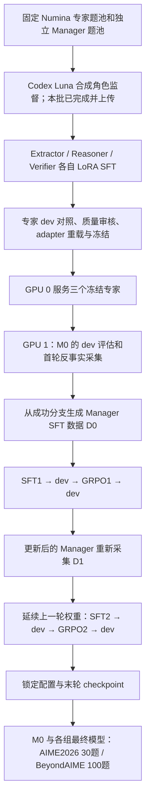

# MARGENT 数学实验：从三专家 SFT 到 Manager RSI 的完整操作手册

更新：2026-09-29。适用代码基线为 main `17c5da8e0cbe4c0e672208816c9a76f7c7a9f1b2`（已包含 Luna 数据 PR #11）；本手册随后的文档提交不改变训练算法。本文命令是给 RunPod 使用者执行的操作步骤，编写文档不会启动 GPU、teacher 或 W&B 实验。

**第一次执行按第 3～10 节顺序进行；第 11 节用于监控，第 12 节用于恢复。** 默认是小规模机制 pilot，不是论文最终规模。每段命令都在明确的目录运行；新终端先加载第 3 节环境文件。不要复制旧实验中的默认数据目录或把旧失败目录改成新实验。

## 1. 整个流程，以及究竟训练谁



模型均为 `Qwen/Qwen3.5-9B`，固定 revision `c202236235762e1c871ad0ccb60c8ee5ba337b9a`。

| 对象 | 起点与训练内容 | 何时更新 |
|---|---|---|
| Extractor | base + 独立 LoRA；条件、变量、约束、目标 | 先进行角色 SFT，随后冻结 |
| Reasoner | base + 另一份 LoRA；数学推导与解题过程 | 同上 |
| Verifier | base + 第三份 LoRA；审查候选，给 Verdict / Evidence / Correction | 同上；它的 verdict 不直接决定 Manager reward |
| Manager | 独立的 base M0 + 自己的 LoRA；独立解答、CALL/COMMIT 决策、调用后的修订 | 每轮 SFT 和 GRPO；不继承某个专家 LoRA |
| 外部答案校验器 | 固定的终值解析与数学等价检查 | 不训练；用于分支选择、最终 reward 和准确率 |

三个专家不是三个完整 base 副本轮流接着训练：它们从同一 pinned base **各自初始化**。服务时一个冻结 base 加载三个角色 adapter。Manager 是另一个模型实例，用另一张 GPU。

**Manager 最初的 SFT 数据不是这 544 条专家 teacher 样本。** M0 先在 Manager train 题池给出独立解答，再枚举最多深度 2 的不重复专家调用（3 条单调用 + 6 条双调用分支）。外部答案校验器检查最终答案，从直接答对或最短成功路线导出 `initial_collection/sft.jsonl`。监督只作用于 Manager 的 assistant 输出；题目、历史、专家回复作为上下文，不训练专家、不对工具文本算 Manager loss。开启 `distill_solutions=true` 时还导出成功解答的 question-only 蒸馏目标。首轮先完成这一步，才有可供 Manager SFT 的标签。

## 2. 当前数据、规模与证据边界

所有现成数据位于 [`data/math_luna_codex_pilot_20260929/`](../data/math_luna_codex_pilot_20260929/)，详见[数据说明](../data/math_luna_codex_pilot_20260929/README.md)。

| 数据 | Train | Dev / Test | 用途 |
|---|---:|---:|---|
| 专家 Numina 唯一题 | 104 | 32 dev | 与完整 Manager 池及外部 test 排除重叠 |
| Extractor 监督行 | 104 | 32 | 共 136 行 |
| Reasoner 监督行 | 104 | 32 | 共 136 行 |
| Verifier 监督行 | 208 | 64 | 每题两条候选审查，共 272 行 |
| Manager 冻结 Numina 池 | 128 | 64 dev | 独立题池；本 pilot 按题 hash 取 16 / 16 |
| AIME2026 | 不训练 | 30 test | M0 与训练后模型的独立外部评测 |
| BeyondAIME | 不训练 | 100 test | 配置锁定后的另一项外部评测 |

合计 **136 个专家题目、544 条角色监督（416 train + 128 dev）**。原始 160 题、960 个生成任务已经完成；机械筛选排除 24 个含控制字符的 train 题及其 96 行监督，保留行未改写。Verifier 的两候选不是两个独立题目。

- 题目来自 pinned NuminaMath-1.5；角色目标来自 **Codex subagent synthesis, selected model gpt-6-luna**。不是在 RunPod 再调 teacher，也不能写成已观测到独立 API 返回的实际模型版本；未知 backend model、token 使用量、采样参数保持 null。
- 三专家用 `sft/` 中的 JSONL；`json/` 的六份普通 JSON 数组与其消息内容等价，供其他训练框架导入。现有脚本不能把 `EXPERT_DATA` 指向 `json/`。
- `manager/` 包含 train/dev/test 及 manifest；AIME 的上游 split 即使叫 train，在本实验中也是 test。不要把它放入 collect、SFT 或 GRPO。
- 专家标签均 `reviewed=false`；15 条 Reasoner 有启发式“推导可能未完成”提示，尚非核实错误数。可做工程试跑，不能据此声称标签全部正确或专家质量已验证。
- 数据与环境检查通过不等于 9B CUDA 已运行。本次专家 SFT、最终 AIME/BeyondAIME 分数尚需实际执行。历史 smoke 和旧 AIME 故障不算这次新实验的结果。

本手册默认参数：

| 阶段 | 固定规模 | 本次停止预算 |
|---|---|---|
| 专家训练 | 3 角色，各 16 optimizer steps；batch 1、accum 8、lr 2e-5、rank 16、alpha 32、dropout .05、BF16；序列上限 8192 | 一个父总控共 120 分钟，重启不重置 deadline |
| 专家 dev 对照 | base 与 SFT；E/R 各 32 行、V 64 行；max tokens 512、context 16384 | 单独 120 分钟，独立持久化预算 |
| Manager pilot | 16 train / 16 dev；dynamic/static/success 三组，各 2 轮 | 三组全部阶段共享最多 24 小时 |
| 每轮 Manager SFT | 8 optimizer steps；batch 1、accum 2、lr 2e-5、rank 16 | 包含在上述 24 小时内 |
| 每轮 Manager GRPO | 8 个题组，每组 4 条 rollout；lr 1e-6、temperature .8、clip .2、KL beta .01 | 包含在上述 24 小时内；题组数与实际更新次数分开记录 |
| 外部 test | M0 + 三组 round_2/grpo；每模型 AIME 30、BeyondAIME 100 | 第 10 节外围命令为每个模型/benchmark 固定 120 分钟；不能保证完成 |

Manager 采集/评测 temperature=0；独立解答和 revision 各最多 2048 tokens，decision 128，advisor 2048，context / SFT sequence 32768。最大调用深度 2，decision 使用 `finite_actions_v1`。这些值来自专家总控生成的 `manager_config.json` 的母板 `configs/math_rsi_actions.json`；修改后须另建配置与实验目录，并重做可比 baseline。

## 3. RunPod 机器与统一环境

专家训练顺序使用一张空闲 GPU。完整 Manager+advisor 流程按 **2 张 80GB GPU** 安排：GPU 0 给专家服务，GPU 1 给 Manager，均为单进程；不要用 `torchrun`。80GB 是当前运行建议，尚不是已实测的显存保证。专家入口实际检查：恰好暴露一张 CUDA、支持 BF16、空闲显存至少 40 GiB。保留足够磁盘存放 base、恢复 checkpoint、三组多轮 adapter 和逐题日志。

选择带 CUDA PyTorch 的 RunPod 镜像（原环境使用 torch 2.8.0）。新克隆路径必须空闲：

```bash
cd /workspace
git clone --branch main https://github.com/Jeremyyny/7.98.git /workspace/7.98
cd /workspace/7.98/agent_routing
git checkout --detach 17c5da8e0cbe4c0e672208816c9a76f7c7a9f1b2
git rev-parse HEAD
nvidia-smi
command -v tmux
command -v timeout
command -v flock
```

若系统缺少 `tmux` / GNU `timeout`，在有系统安装权限的 Debian/Ubuntu Pod 执行：

```bash
apt-get update
apt-get install -y tmux coreutils util-linux
```

创建本次实验专用环境文件。`01` 是新实验 ID；如果这些目录已属于另一次试验，把相关目录和 session **一起换成新 ID**，不要覆盖旧证据。

```bash
cat > /workspace/margent-luna-env.sh <<'EOF'
export MARGENT_CODE=/workspace/7.98/agent_routing
export MARGENT_VENV=/workspace/margent-venv
export MARGENT_RUN_ROOT=/workspace/margent-luna-setup-01
export HF_HOME=/workspace/hf-cache
export HF_HUB_CACHE=/workspace/hf-cache/hub
export HF_DATASETS_CACHE=/workspace/hf-cache/datasets
export HF_HUB_DISABLE_XET=1
export TMPDIR=/workspace/margent-tmp
export PYTHONUNBUFFERED=1
export EXPERT_PYTHON=/workspace/margent-venv/bin/python
export LUNA_DATA=/workspace/7.98/agent_routing/data/math_luna_codex_pilot_20260929
export EXPERT_CONFIG="$LUNA_DATA/configs/expert_sft_text_clean.json"
export EXPERT_DATA="$LUNA_DATA/sft"
export EXPERT_MANAGER_DATA="$LUNA_DATA/manager"
export EXPERT_ROOT=/workspace/margent-luna-experts-01
export EXPERT_SESSION=margent-luna-experts-01
export EXPERT_GPU=0
export RSI_PYTHON="$EXPERT_PYTHON"
export RSI_EXPERT_ROOT="$EXPERT_ROOT"
export RSI_CONFIG="$EXPERT_ROOT/manager_config.json"
export RSI_DATA="$EXPERT_MANAGER_DATA"
export RSI_SUBSET=/workspace/margent-luna-manager-data-16-01
export RSI_OUTPUT=/workspace/margent-luna-manager-pilot-01
export RSI_ADVISOR_GPU=0
export RSI_MANAGER_GPU=1
export EVAL_ROOT=/workspace/margent-luna-tests-01
export WANDB_ENTITY=yuningyangaillm
export WANDB_PROJECT=MATH_rsi
export MARGENT_WANDB_MODE=online
export MARGENT_WANDB_TEXT=1
EOF
source /workspace/margent-luna-env.sh
mkdir -p "$TMPDIR" "$MARGENT_RUN_ROOT"
cd "$MARGENT_CODE"
bash scripts/runpod_math_setup.sh
"$EXPERT_PYTHON" -m pip check
```

setup 继承镜像中的 CUDA torch，不重新安装 torch；安装 `requirements-math.txt`（Transformers 5.3.0、TRL 0.29.0、PEFT 0.18.1、W&B 0.30.0 等），运行所列测试，并保存 `environment.lock.txt` / `nvidia-smi.txt`。已有可用 venv 可复用；不应在实验进行中升级包或更新代码。

每个新终端的固定开头：

```bash
source /workspace/margent-luna-env.sh
cd "$MARGENT_CODE"
```

## 4. 数据验证、模型预下载、W&B 登录检查

下面数据验证不加载 9B、不调用 teacher、不训练：

```bash
"$EXPERT_PYTHON" "$LUNA_DATA/validate_data.py"
```

预期 `valid=true`、`sft_rows=544`、train=104/dev=32、JSON 等价和隔离检查通过。不要为绕过数量检查把 104 改回旧的 128。完整 Manager 排除池必须用 `manager/`，不能换成 16 题 subset。

在训练 120 分钟计时开始**之前**下载 pinned base 到共享缓存：

```bash
"$EXPERT_PYTHON" - <<'PY'
from huggingface_hub import snapshot_download
snapshot_download("Qwen/Qwen3.5-9B", revision="c202236235762e1c871ad0ccb60c8ee5ba337b9a")
PY
```

沿用用户在 Pod 的 W&B 登录。如果尚未登录，自己在交互终端执行下面的 login；不把 key 写入 GitHub、环境文件、聊天或日志：

```bash
"$EXPERT_PYTHON" -m wandb login
"$EXPERT_PYTHON" -m src.verifiable wandb-check --out /workspace/margent-luna-wandb-check-01
cat /workspace/margent-luna-wandb-check-01/wandb_link.json
```

打开输出 URL，确认项目正确，job_type 为 `tracking_check` 且能看到 `check/logging_check`；这只证明日志连接，没有训练模型。不想重复登录时可直接先做 `wandb-check`。默认上传样本文本与错误日志；`MARGENT_WANDB_TEXT=0` 可关闭文本，但后续排错和论文审计材料会变少。

## 5. 第一步训练：三个 subagent 的独立 SFT

```bash
bash scripts/runpod_expert_sft.sh plan
bash scripts/runpod_expert_sft.sh start --minutes 120
bash scripts/runpod_expert_sft.sh status
tail -n 60 "$EXPERT_ROOT.log"
```

`plan` 只展示将要执行的命令，实际数据检查已在第 4 节执行。`start` 自己创建 tmux session，不要再包一层同名 session。流程依次为：数据检查 → 保存冻结数据副本 → 显存检查 → extractor SFT → reasoner SFT → verifier SFT → 导出 experts.json → 实际重载三个 adapter 并切换 → 生成 Manager 配置与完成报告。单有 experts.json 不能证明重载成功。它不会自动进入 Manager 训练或 AIME。

```bash
tmux attach -t "$EXPERT_SESSION"
```

查看后用 **Ctrl+B 再按 D** 退出查看，训练继续。不要用 Ctrl+C 代替 detach。

完成后检查：

```bash
"$EXPERT_PYTHON" -m json.tool "$EXPERT_ROOT/expert_report.json"
"$EXPERT_PYTHON" -m json.tool "$EXPERT_ROOT/experts.json"
"$EXPERT_PYTHON" -m json.tool "$EXPERT_ROOT/manager_config.json"
```

关键产物：

```text
/workspace/margent-luna-experts-01/
  expert_run.json                 数据/配置/代码与运行设置
  budget.json                     原始截止时间
  data/                          训练器使用的冻结数据副本
  training/extractor/            独立 LoRA + Trainer checkpoint
  training/reasoner/
  training/verifier/
  experts.json                   三个角色的 adapter 路径和指纹
  manager_config.json            Manager 配置，绑定冻结专家与数据隔离信息
  expert_report.json             总控完成与重载结论
  logs/                          逐阶段日志
```

成功依据为总控 `experts_complete=true`、三角色都达到预定 16 optimizer steps、adapter 文件及指纹有效、重载/切换验证成功。某一个 `expert_sft` 子 run Finished 不能代替整套专家完成。

## 6. 专家 dev 对照与质量检查

在启动常驻 advisor **之前**执行；它也需要 GPU 0。比较同一 base 的 prompt-only 与角色 SFT 输出：

```bash
tmux new-session -d -s margent-luna-expert-dev-01 \
  bash -lc 'set -e; source /workspace/margent-luna-env.sh; cd "$MARGENT_CODE"; CUDA_VISIBLE_DEVICES="$EXPERT_GPU" "$EXPERT_PYTHON" -m src.verifiable.expert_eval --bundle "$EXPERT_ROOT/experts.json" --data-dir "$EXPERT_ROOT/data" --out "$EXPERT_ROOT/dev_comparison" --limit 64 --max-tokens 512 --max-context 16384 --minutes 120 > "$EXPERT_ROOT.dev-comparison.log" 2>&1'
tail -n 60 "$EXPERT_ROOT.dev-comparison.log"
```

`--limit 64` 是**每角色最多 64 行**：实际 E/R 各 32、V 64，两种条件共预期 256 次生成，覆盖完整 dev。查看 `dev_comparison/report.json` 的 `evaluation_complete`、`expected_generations` 与 `completed_generations`，以及 `review.jsonl` 中 base/SFT 的并排结果。旧命令 `--limit 32` 只会做 192 次生成，漏掉半数 Verifier dev；需要较小诊断时须事先说明范围并使用新目录。

角色审核：Extractor 是否忠实提取、不编条件；Reasoner 是否推导完整、无数学错误；Verifier 是否真正定位错误、修正有依据。当前自动 Verifier 分数是**与 teacher 标签一致性**，不是独立正确率；Extractor/Reasoner 也没有自动质量合格证明。记录具体审核结论后再把该专家版本用于主实验；不要直接把 dev loss 下降写成专家变强。

特别注意：专家评估达到预算时，W&B 界面可能 Finished，但 `controller_status=budget_exhausted`、`evaluation_complete=false`。须按语义完成字段判断。仅在预算未耗尽的中断下，原命令/目录可以恢复；预算耗尽保持 incomplete。修改 limit、长度或 bundle 要用新目录。

## 7. 冻结并启动三个专家的服务

专家训练和 dev 任务结束、GPU 0 空闲后执行：

```bash
test -f "$EXPERT_ROOT/experts.json"
test -f "$RSI_CONFIG"
tmux new-session -d -s margent-luna-advisor-01 \
  bash -lc 'set -e; source /workspace/margent-luna-env.sh; cd "$MARGENT_CODE"; bash scripts/runpod_rsi_pilot.sh advisor > "$EXPERT_ROOT.advisor.log" 2>&1'
tail -n 60 "$EXPERT_ROOT.advisor.log"
curl -fsS http://127.0.0.1:8001/health
```

等待 health 为 ready；核对返回的专家身份/指纹与 `experts.json`。这里使用 `src.verifiable.experts serve --config "$RSI_CONFIG"`，不要换成旧的 prompt-only 服务。已有 8001 服务或同名 session 时先确认其归属，别启动第二份或停止其他实验。

然后在 Manager GPU 做 API、模板与服务检查：

```bash
CUDA_VISIBLE_DEVICES="$RSI_MANAGER_GPU" "$RSI_PYTHON" -m src.verifiable doctor \
  --config "$RSI_CONFIG" --out /workspace/margent-luna-doctor-01.json
```

doctor 不是完整训练测试。原 `runpod_rsi_smoke.py` 会自己启动 prompt-only advisor，不能拿它代替本次训练专家的端到端验证；本次真实专家组合是否跑通，要看随后 pilot 的实际阶段与重载结果。

## 8. 第二步训练：Manager 三组两轮 RSI pilot

### 8.1 准备 16 / 16 子集并查看全部阶段

环境文件已明确设定 `RSI_DATA="$LUNA_DATA/manager"`；这会覆盖脚本中的旧默认数据路径。

```bash
bash scripts/runpod_rsi_pilot.sh plan > /workspace/margent-luna-manager-plan-01.txt
cat /workspace/margent-luna-manager-plan-01.txt
"$RSI_PYTHON" -m json.tool "$RSI_SUBSET/pilot_data.json"
```

plan 按标准化题 hash 升序从新 128/64 池固定取 16 train / 16 dev，并打印 31 个阶段：共享 initial_dev + initial_collection；三组各两轮的 SFT/dev/GRPO/dev；第二轮各组 recollect；success 组每轮另有 selection。prepare 会读取完整源 manifest（含 test 文件）校验 hash/隔离，但不会对外部 test 做推理、生成标签或训练。

### 8.2 启动一次总控

```bash
tmux new-session -d -s margent-luna-manager-01 \
  bash -lc 'set -e; source /workspace/margent-luna-env.sh; cd "$MARGENT_CODE"; bash scripts/runpod_rsi_pilot.sh run >> "$RSI_OUTPUT.controller.log" 2>&1'
tail -n 80 "$RSI_OUTPUT.controller.log"
bash scripts/runpod_rsi_pilot.sh report
```

刚启动还没生成 `rsi_run.json` 时，report 可能暂不可用。总控最多 24 小时（含初始评估、采集、训练、逐阶段 dev），原 deadline 持久化；不承诺 24 小时内全做完，也不会停止另一终端中的 advisor 或 Pod 计费。

**三组条件：**

| arm | round 1 | round 2 |
|---|---|---|
| dynamic | 首轮共享树中选择直接提交/最短成功路线 | 用自己的 GRPO1 Manager 重采集，训练新标签 |
| static | 同一首轮 MARGENT 标签 | 仍用首轮标签；另采 shadow tree 仅测变化/计成本 |
| success | 同一搜索树，匹配覆盖与配比后选择成功轨迹 | 当前 Manager 重采集，重新选成功轨迹 |

各组在第二轮都从**自己上一轮 GRPO adapter**继续 SFT；不会回到 base。跨阶段 SFT 新建 optimizer，GRPO reference 固定为本轮入口 SFT；同一阶段中断恢复则恢复已保存的训练状态。

### 8.3 每个阶段具体做什么

| 相对 `$RSI_OUTPUT` 路径 | 输入 | 工作与输出 |
|---|---|---|
| `initial_dev/` | M0 + 16 dev + 冻结专家 | independent/policy 双评估，`records.jsonl`、`summary.json` |
| `initial_collection/` | M0 + 16 train + 冻结专家 | 反事实树、成功路线选择、`records.jsonl`、`sft.jsonl` |
| `ARM/round_1/selection/` | 只限 success 组的共享树 | 另选成功轨迹，输出 SFT 目标 |
| `ARM/round_1/sft/` | 本组 D0；base 初始化 Manager LoRA | 8 次 optimizer updates，adapter、`training_metrics.json` |
| `ARM/round_1/sft_dev/` | SFT1 + 16 dev | 双评估，不训练 |
| `ARM/round_1/grpo/` | SFT1 + train 题 | 8 个题组 × 4 rollouts、逐步诊断、最终 adapter |
| `ARM/round_1/grpo_dev/` | GRPO1 + 同一 dev | 双评估 |
| `ARM/round_2/collection/` | 本组 GRPO1 + 16 train | 重新计算直接答对/救回路线；static 仅用于诊断 |
| `ARM/round_2/{sft,sft_dev,grpo,grpo_dev}/` | 本组上一权重 + 对应新/旧目标 | 第二轮同样的 8 SFT updates + 8 GRPO groups 与 dev |

SFT 的 8 步不是 8 个 epoch。GRPO 的 8 步是题组预算：当前从 train16 的确定性洗牌序列取前8题，同seed的后续阶段仍使用相同题序，并未遍历全部16题；每组共用一条初始独立草稿，再采样四条决策/修订轨迹。初始草稿不进入这组 RL loss，专家输出只作条件上下文。奖励是**协议有效且最终答案正确为 1，否则 0**，不加调用惩罚，不用 verifier 自报 verdict 当奖励。无效或截断按实际规则记录，不通过失败重采样制造混合 reward。

### 8.4 目前仍存在的 pilot 停止条件

- 首轮 `initial_gate.json` 要求至少 2 个 rescue 和 2 个 direct commit；不足时表示机制样本不足，默认停止后续训练，不是凭准确率判程序坏掉。
- 单个全 0 或全 1 reward group 允许存在，outcome advantage 为 0；整个 GRPO 阶段若混合奖励组少于 1，总控停止后续阶段。
- 数据/代码/配置/adapter 身份不一致、OOM、不可恢复服务错误、超时会停止。
- 普通 advisor 截断不再一律导致整个采集批次异常退出；其无效性/成本保留。AIME 专用脚本的格式检查默认是警告，与本节机制信号门槛不是同一个开关。

不为了让同一个 run 显示成功而改低门槛、挑题、删除失败文件。需要扩大题池、提高生成长度或研究没有混合奖励的情况时，保留本次结果，另立新配置/目录并注明改变。

### 8.5 总体完成确认

```bash
bash scripts/runpod_rsi_pilot.sh report
"$RSI_PYTHON" -m json.tool "$RSI_OUTPUT/pilot_report.json"
"$RSI_PYTHON" -m json.tool "$RSI_OUTPUT/run_summary.json"
```

完整 pilot 应同时具备：父总控 `controller_status=completed` / `pilot_complete=true`；`pilot_report.json` 的 `complete=true`、31/31 阶段；每阶段 `.rsi_complete.json` 与对应真实产物；各 dev `n=16`、相同题 ID；三组最终 adapter 可重载。最终指标表是 `pilot_timeline.csv`。子阶段 Finished、已有一份 adapter 或 controller 仍 running 都不等于全流程完成。

## 9. 单阶段命令：排错和理解接线

通常由第 8 节总控执行。以下示例会真实采集/训练，**仅在需要独立调试且主总控未占用 GPU 1 时执行**；使用独立输出，不手工填补总控目录或伪造 `.rsi_complete.json`。单阶段 CLI 没有总控的 24 小时限制。

```bash
export MANUAL_ROOT=/workspace/margent-luna-manual-01
CUDA_VISIBLE_DEVICES=1 "$RSI_PYTHON" -m src.verifiable.rsi stage collect \
  --config "$RSI_CONFIG" --checkpoint Qwen/Qwen3.5-9B \
  --data "$RSI_SUBSET/train.jsonl" --out "$MANUAL_ROOT/collection"

CUDA_VISIBLE_DEVICES=1 "$RSI_PYTHON" -m src.verifiable.rsi stage sft \
  --config "$RSI_CONFIG" --checkpoint Qwen/Qwen3.5-9B \
  --data "$MANUAL_ROOT/collection/sft.jsonl" --out "$MANUAL_ROOT/sft"

CUDA_VISIBLE_DEVICES=1 "$RSI_PYTHON" -m src.verifiable.rsi stage assess \
  --config "$RSI_CONFIG" --checkpoint "$MANUAL_ROOT/sft" \
  --data "$RSI_SUBSET/dev.jsonl" --out "$MANUAL_ROOT/sft_dev"

CUDA_VISIBLE_DEVICES=1 "$RSI_PYTHON" -m src.verifiable.rsi stage grpo \
  --config "$RSI_CONFIG" --checkpoint "$MANUAL_ROOT/sft" \
  --data "$RSI_SUBSET/train.jsonl" --out "$MANUAL_ROOT/grpo"

CUDA_VISIBLE_DEVICES=1 "$RSI_PYTHON" -m src.verifiable.rsi stage collect \
  --config "$RSI_CONFIG" --checkpoint "$MANUAL_ROOT/grpo" \
  --data "$RSI_SUBSET/train.jsonl" --out "$MANUAL_ROOT/collection2"

CUDA_VISIBLE_DEVICES=1 "$RSI_PYTHON" -m src.verifiable.rsi stage sft \
  --config "$RSI_CONFIG" --checkpoint "$MANUAL_ROOT/grpo" \
  --data "$MANUAL_ROOT/collection2/sft.jsonl" --out "$MANUAL_ROOT/sft2"
```

这里故意明确第二轮输入是 GRPO 权重。它只是 dynamic 一条路径的调试例子，不替代三组对照、预算、门槛和总报告。旧 `python -m src.verifiable loop` 只做 SFT；旧 `rl` 入口不能代替本手册的 `src.verifiable.rsi stage grpo`。

## 10. 独立 benchmark：M0 与三个最终 Manager

### 10.1 先冻结比较对象，再看 test

本手册主比较为四个 Manager：M0、dynamic/static/success 各自 `round_2/grpo`；每个都用**同一份训练后冻结专家**、相同生成预算/seed/grader，在完整 AIME2026 30 题与 BeyondAIME 100 题上各测一次，共八格。每格一次 `evaluate` 同时得到 independent 和 policy 成绩，不必再分两次跑。

若研究“第一轮 SFT 相对 GRPO 的增益”，可以在看 test **之前**另增 `dynamic/round_1/sft` 与 `dynamic/round_1/grpo`。`round_2/sft` 已继承上一轮 GRPO，不能称为纯 SFT 基线。专家本身的贡献要另做固定 Manager 的 prompt-only / trained-advisor 消融，不能把更强专家和更强 Manager 两种变化全记在 Manager 头上。

使用第 7 节同一个已 ready 的 advisor 服务。先确认 Manager 总控已退出、GPU 1 空闲且三组完成；不要与训练并行抢卡。没有完成的组应报告 incomplete，不用某个较早 checkpoint 冒充预先指定的最终模型。

当前 `evaluate-suite` / `paper-check` 服务于旧 SFT `loop.json`，**不直接支持当前 RSI 的 `rsi_run.json`**；不要对 RSI 目录执行这些旧“一键”入口。下面明确调用真正的 `evaluate --resume`。

### 10.2 创建透明的评估命令文件

下面生成的是本次运行的 shell 命令文件；它串行执行八格，不改训练代码。**每格首次启动写入 120 分钟绝对截止时间，重启同格不延长**；预算记录在 stage 目录外，避免破坏训练器的空目录/签名检查。预算到时发出中断信号，最多再留60秒清理后强制终止当前 Manager 评估进程组，保留题目分片；advisor 和 Pod 仍由你管理。8×120 分钟是八格的最大预算总和，不是预计完成时间。

先创建文件，查看内容，然后执行下一小节的启动命令：

```bash
cat > /workspace/margent-luna-evaluate-01.sh <<'SH'
#!/usr/bin/env bash
set -euo pipefail
source /workspace/margent-luna-env.sh
cd "$MARGENT_CODE"
mkdir -p "$EVAL_ROOT/budgets" "$EVAL_ROOT/logs"
# Linux flock：防止同一矩阵被重复启动。不要并行启动单格 evaluate。
exec 9>"$EVAL_ROOT/.matrix.lock"
flock -n 9 || { echo 'This test matrix already has a running process' >&2; exit 1; }

"$RSI_PYTHON" - <<'PY'
import json, os
from pathlib import Path
p = Path(os.environ['RSI_OUTPUT'])
report = json.loads((p/'pilot_report.json').read_text())
summary = json.loads((p/'run_summary.json').read_text())
assert report['complete'] and report['completed_stages'] == report['planned_stages'] == 31
assert summary['pilot_complete'] and summary['controller_status'] == 'completed'
for arm in ('dynamic', 'static', 'success'):
    out = p/arm/'round_2/grpo'
    assert (out/'.rsi_complete.json').is_file() and (out/'adapter_config.json').is_file()
    assert (out/'training_metrics.json').is_file()
PY

run_eval() {
  local label="$1" checkpoint="$2" benchmark="$3" remaining
  # Same label must keep the same inputs. Core evaluate additionally checks
  # checkpoint contents, code/harness, advisor identity and full run manifest.
  remaining=$("$RSI_PYTHON" - "$EVAL_ROOT/budgets/$label-$benchmark.json" \
    "$RSI_CONFIG" "$LUNA_DATA/manager/$benchmark.jsonl" "$checkpoint" <<'PY'
import hashlib, json, math, sys, time
from pathlib import Path
target, config, data, checkpoint = sys.argv[1:]
digest = lambda p: hashlib.sha256(Path(p).read_bytes()).hexdigest()
signature = {'config_sha256': digest(config), 'data_sha256': digest(data),
             'checkpoint': checkpoint, 'minutes': 120}
p = Path(target)
if p.exists():
    budget = json.loads(p.read_text())
    if budget['signature'] != signature:
        raise SystemExit('Budget inputs changed; use a new experiment directory')
else:
    budget = {'signature': signature, 'deadline_unix': time.time() + 120*60}
    with p.open('x') as f:
        json.dump(budget, f, indent=2)
left = math.floor(budget['deadline_unix'] - time.time())
if left <= 0:
    raise SystemExit('Original evaluation deadline exhausted; retain incomplete evidence')
print(left)
PY
  )
  timeout --signal=INT --kill-after=60s "${remaining}s" \
    env CUDA_VISIBLE_DEVICES="$RSI_MANAGER_GPU" "$RSI_PYTHON" -u -m src.verifiable evaluate \
    --config "$RSI_CONFIG" --checkpoint "$checkpoint" \
    --data "$LUNA_DATA/manager/$benchmark.jsonl" \
    --out "$EVAL_ROOT/$label/$benchmark" --resume \
    >> "$EVAL_ROOT/logs/$label-$benchmark.log" 2>&1
}

for label in base dynamic_final static_final success_final; do
  case "$label" in
    base) checkpoint=Qwen/Qwen3.5-9B ;;
    dynamic_final) checkpoint="$RSI_OUTPUT/dynamic/round_2/grpo" ;;
    static_final) checkpoint="$RSI_OUTPUT/static/round_2/grpo" ;;
    success_final) checkpoint="$RSI_OUTPUT/success/round_2/grpo" ;;
  esac
  for benchmark in aime2026 beyondaime; do
    # Completed outputs are still checked by the verification command below.
    if "$RSI_PYTHON" - "$EVAL_ROOT/$label/$benchmark" "$benchmark" <<'PY'
import json, sys
from pathlib import Path
p, benchmark = Path(sys.argv[1]), sys.argv[2]
try:
    summary = json.loads((p/'summary.json').read_text())
    status = json.loads((p/'status.json').read_text())
    ok = status['status'] == 'completed' and summary['n'] == {'aime2026':30,'beyondaime':100}[benchmark]
except (OSError, ValueError, KeyError):
    ok = False
raise SystemExit(0 if ok else 1)
PY
    then
      echo "Already recorded: $label / $benchmark; verify all IDs before reporting"
      continue
    fi
    echo "Evaluating: $label / $benchmark"
    run_eval "$label" "$checkpoint" "$benchmark"
  done
done
SH
cat /workspace/margent-luna-evaluate-01.sh
```

该外围命令没有生成新的 W&B 父总控，也没有 `baseline_complete` 标记。八格各自 `evaluate` 的 W&B 链接和本地文件才是实际证据。它默认失败即停；超时常见 shell exit code 124（强杀可能为 137），不等于模型正确率为零。若第一格未完成，后面的格子尚未运行。

### 10.3 启动、查看和验证八格结果

```bash
tmux new-session -d -s margent-luna-tests-01 \
  bash -lc 'bash /workspace/margent-luna-evaluate-01.sh >> /workspace/margent-luna-tests-01.controller.log 2>&1'
tail -n 60 /workspace/margent-luna-tests-01.controller.log
tail -n 60 "$EVAL_ROOT/logs/base-aime2026.log"
```

完成后执行下面的**无 GPU**校验和成绩导出。它检查每格真实题 ID、分片一致、数量和结束状态；缺少任何一格就失败，不把部分结果当全量：

```bash
"$RSI_PYTHON" - <<'PY'
import csv, hashlib, json, os
from pathlib import Path
from src.verifiable.data import identity, load_rows, verify_manifest
from src.verifiable.runner import load_config, checkpoint_identity, validate_resume_records
from src.verifiable.provenance import harness_identity
from src.verifiable.experiment import summary as summarize
from src.verifiable.serve import load_expert_bundle, expert_bundle_sha256
root, data = Path(os.environ['EVAL_ROOT']), Path(os.environ['LUNA_DATA'])/'manager'
cfg = load_config(os.environ['RSI_CONFIG'])
verify_manifest(str(data))
bundle = load_expert_bundle(cfg['advisor_expert_bundle'], cfg['base_model'], cfg['base_model_revision'])
bundle_hash = expert_bundle_sha256(bundle)
advisor = json.loads((Path(os.environ['RSI_OUTPUT'])/'advisor_identity.json').read_text())
assert advisor['expert_bundle'] == bundle and advisor['expert_bundle_sha256'] == bundle_hash
rows = []
for label in ('base','dynamic_final','static_final','success_final'):
    checkpoint = 'Qwen/Qwen3.5-9B' if label == 'base' else str(Path(os.environ['RSI_OUTPUT'])/label.removesuffix('_final')/'round_2/grpo')
    for benchmark, expected_n in (('aime2026',30),('beyondaime',100)):
        p = root/label/benchmark
        source = [json.loads(x) for x in (data/f'{benchmark}.jsonl').read_text().splitlines() if x.strip()]
        expected = {identity(x['question']) for x in source}
        records = [json.loads(x) for x in (p/'records.jsonl').read_text().splitlines() if x.strip()]
        summary = json.loads((p/'summary.json').read_text())
        status = json.loads((p/'status.json').read_text())
        run = json.loads((p/'run.json').read_text())
        assert len(source) == len(expected) == len(records) == summary['n'] == expected_n
        assert {x['question_hash'] for x in records} == expected
        assert status['status'] == 'completed' and run['config'] == cfg
        assert run['checkpoint'] == checkpoint_identity(checkpoint)
        assert json.loads((p/'advisor_identity.json').read_text()) == advisor
        assert run['data_sha256'] == hashlib.sha256((data/f'{benchmark}.jsonl').read_bytes()).hexdigest()
        assert run['mode'] == 'evaluate' and run['limit'] == 0 and run['harness'] == harness_identity()
        validate_resume_records(records, load_rows(str(data/f'{benchmark}.jsonl'), required_split='test'), 'evaluate')
        observed = summarize(records)
        for key in ('n','independent_correct_n','policy_correct_n','independent_accuracy','policy_accuracy','mean_calls'):
            assert summary[key] == observed[key]
        shards = {x.stem:json.loads(x.read_text()) for x in (p/'questions').glob('*.json')}
        assert set(shards) == expected and all(shards[x['question_hash']] == x for x in records)
        rows.append({'checkpoint':label,'benchmark':benchmark,'n':expected_n,
                     'independent_correct_n':summary['independent_correct_n'],
                     'policy_correct_n':summary['policy_correct_n'],
                     'independent_accuracy':summary['independent_accuracy'],
                     'policy_accuracy':summary['policy_accuracy'],
                     'mean_calls':summary['mean_calls']})
with (root/'scores.csv').open('w', newline='') as f:
    writer=csv.DictWriter(f,fieldnames=list(rows[0])); writer.writeheader(); writer.writerows(rows)
print(json.dumps({'verified_cells':len(rows),'scores':rows},ensure_ascii=False,indent=2))
PY
```

这里的 `scores.csv` 是计数与点估计表，不是已包含配对区间、多 seed 或因果结论的论文分析。继续保留每题 records，按 question_hash 配对计算 wrong→correct / correct→wrong 和区间。

### 10.4 可选：先单独跑一次有总控的 M0 AIME baseline

这不是八格后训练模型评估的替代入口。若要在 Manager 训练前单独验证 M0 AIME，先完成专家训练和质量检查，**在启动第 7 节常驻 advisor 前**执行下面命令。它使用 GPU 0/1、自建 8003 专家服务，结束后清理自己的服务；不能同时开另一份 advisor 抢占 GPU。

```bash
tmux new-session -d -s margent-luna-aime-base-01 \
  bash -lc 'set -e; source /workspace/margent-luna-env.sh; cd "$MARGENT_CODE"; "$RSI_PYTHON" -u scripts/runpod_aime_baseline.py --out /workspace/margent-luna-aime-base-01 --data-dir "$LUNA_DATA/manager" --config "$RSI_CONFIG" --minutes 120 --manager-gpu 1 --advisor-gpu 0 --port 8003 >> /workspace/margent-luna-aime-base-01.log 2>&1'
```

该入口只测 config 的 **base Manager**，没有 `--checkpoint` 参数，不能把 base_model 改成 LoRA 路径来冒充 SFT/GRPO 评测。它做 3 dev 题、一次计划内中断与恢复验证，然后完整 30 AIME 题；父运行 `planned_dev_interruption=true` 时的子中断不是意外故障。格式/截断默认仅记录警告，`--strict-preflight` 才启用硬质量门槛；预计时长 +25% 超过剩余预算仍可提前停止。原始 120 分钟绝对截止持久化。

只有父运行 `baseline_complete=true`、`baseline_report.json` 的 status=completed/n=30、30 个题 ID 全部齐全才算完整。此前旧组 `margent-aime-baseline-01-2ed29fc3` 失败/0题，不等于准确率0，也不属于本次新结果。可选 baseline 会提前接触 AIME，必须披露，之后不能用 AIME 分数来调训练设置。

## 11. 怎么监控 W&B：项目、分组、曲线、错误

项目：[yuningyangaillm/MATH_rsi](https://wandb.ai/yuningyangaillm/MATH_rsi)。不要仅看最近一个 Finished。W&B 列表中按 **Group** 聚合，再查看总控和各子阶段；源码自动用 `实验目录名-8位后缀` 创建 group，实际名字见 `wandb_experiment.json`。单设 `WANDB_RUN_GROUP` 不能覆盖这套实现。

### 11.1 首先拿到真实 run 链接

```bash
"$RSI_PYTHON" - <<'PY'
import json, os
from pathlib import Path
for key in ('EXPERT_ROOT','RSI_OUTPUT','EVAL_ROOT'):
    root=Path(os.environ[key])
    for p in sorted(root.rglob('wandb_link.json')):
        if {'tracking_exports','wandb'} & set(p.relative_to(root).parts):
            continue
        value=json.loads(p.read_text())
        print(str(p.parent), value.get('stage'), value.get('group'), value.get('url'))
PY
```

| 流程 | W&B job_type | 过滤/定位方式 |
|---|---|---|
| 三专家父总控 | `expert_sft_controller` | group 以 `margent-luna-experts-01-` 开头 |
| 三个训练子 run | `expert_sft` | `config.expert_role`；`stage_path=training/ROLE` |
| adapter 重载 | `expert_reload` | `stage_path=reload_smoke` |
| 专家 dev 对照 | `expert_eval` | 当前路径下为同专家 group 的 `dev_comparison` |
| Manager 父总控 | `rsi_controller` | group 以 `margent-luna-manager-pilot-01-` 开头 |
| Manager 采集 | `collect` | initial_collection 或 ARM/round_N/collection |
| Manager SFT | `sft` | `config.arm`、`config.round`、stage_path |
| Manager GRPO | `rsi_grpo` | 同上 |
| Manager dev | `assess` | initial_dev、sft_dev、grpo_dev；初始 `arm=shared` |
| 外部 test | `evaluate` | 八格在独立目录，可能各有自己的 group；用本地链接清单关联 |
| 可选 AIME 父总控 | `aime_baseline` | 子 run job_type 为 assess/evaluate，路径 dev_preflight/aime2026 |

Codex 离线合成证据在数据包中，不保证此前 960 个任务在 W&B 有一个 teacher 生成 run。不要补造历史在线日志或虚构 teacher 费用。

### 11.2 推荐建立的 W&B panels

在 project workspace 新建下表曲线；按 arm/round/expert_role 分组，配置和值的名字以表中真实字段为准。指标值通常为 0～1 比例，不是自动乘100的百分数。

| Panel | Y 轴字段 | X 轴/解释 |
|---|---|---|
| 专家与 Manager SFT | `train/loss`、`train/learning_rate`、`train/grad_norm`（实际有记录时） | `trainer_step`；训练交叉熵，不是数学准确率 |
| 专家 dev loss | `expert_dev/eval_loss` | 手工选择 `trainer_step`；独立角色质量仍看 review |
| 专家 dev 标签一致性 | `expert_dev/trained/verifier/teacher_label_agreement/accuracy`、同路径 macro_f1；对照 prompt_only | teacher 一致性，不能命名为真值正确率 |
| Manager dev/test 双成绩 | `eval/independent_accuracy`、`eval/policy_accuracy`、`eval/n` | `diagnostic_step`；跨 checkpoint 学习曲线结合 `pilot_timeline.csv`，不能把各 run 的一步当统一训练 step |
| 正确题数 | `eval/independent_correct_n`、`eval/policy_correct_n` | 成绩必须同时显示整数 k/n |
| 路由与坏输出 | `eval/mean_calls`、`eval/direct_valid_rate`、`eval/direct_truncated_rate`、`eval/policy_valid_rate` | 比较调用数、无效和截断 |
| 专家救回/损害 | `eval/policy_rescued_n`、`eval/policy_harmed_n`、`eval/currently_independent_call_rate` | 题级机制诊断，连同 n 解释 |
| GRPO 训练 reward | `grpo/reward_mean`、`grpo/reward_std`、`grpo/valid_rate`、`grpo/mixed_reward_group` | `trainer_step` 在这里是 group 序号，不是独立评测题数 |
| GRPO 学习信号 | `grpo/advantage_abs_mean`、`grpo/zero_advantage_fraction`、`grpo/gradient_norm`、`grpo/optimizer_steps`、`grpo/optimizer_update_applied` | 区分已完成题组与真正 optimizer 更新 |
| GRPO 优化稳定性 | `grpo/policy_loss`、`grpo/weighted_kl_loss`、`grpo/sampled_kl_per_token`、`grpo/clip_fraction` | 与 reward/valid/advantage 一起看 |
| 成本与生成 | `usage/manager/generated_tokens`、`usage/advisor/generated_tokens`、`generation/manager/truncated`、`generation/manager/seconds` | 生成步或时间；失败/恢复成本也需保留 |
| 机器/磁盘 | `system/elapsed_seconds`、`system/disk_free_gib`、`gpu/0/memory_used_mib`、`gpu/0/utilization_percent` | GPU 是设备级，可能含其他进程，编号按日志确认 |

总控 summary 字段要加入 Runs 表的列：`controller_status`、`current_stage`、`failed_stage`、`completed_stages`、`planned_stages`、`heartbeat_at`、`last_progress_at`，以及专家 `experts_complete` / RSI `pilot_complete` / AIME `baseline_complete`。没有出现的字段不要当0；不同 job_type 的完成键并不统一。

训练 reward 上升、SFT loss 下降、Verifier 标签一致性上升分别是不同观测。只有在相同独立 dev/test 集上的 `independent_accuracy` / `policy_accuracy` 前后配对变化，才能讨论相应泛化表现；一次4轨迹GRPO或n=1 smoke都不能代替完整 benchmark。

### 11.3 本地心跳和日志比远端图更适合排错

```bash
bash scripts/runpod_expert_sft.sh status
bash scripts/runpod_rsi_pilot.sh report
"$RSI_PYTHON" -m src.verifiable status --run-dir "$RSI_OUTPUT"
"$RSI_PYTHON" -m src.verifiable status --run-dir "$RSI_OUTPUT/dynamic/round_1/grpo"
tail -n 80 "$RSI_OUTPUT.controller.log"
```

Monitor 通常每20秒写心跳；比较 `updated_at`/`heartbeat_at` 和 `last_progress_at`、阶段、完成题数、训练步数。只有已知应该继续的任务跨检查周期没有新心跳或进度，才标注“疑似停滞”：可能是长生成、W&B断网、进程终止或 Pod 问题。`status` 的约120秒 stale 阈值只是诊断，不是自动杀进程的依据；**GPU利用率0不足以判失败**。

| 看到的情况 | 先检查什么 |
|---|---|
| 父 run running、子阶段 Finished、无下一阶段 | current_stage、failed_stage、父本地日志；可能总控异常，不能报全完成 |
| W&B 不更新、本地继续 | `status.json.wandb_status`、events 中 wandb_warning；计算可能仍继续 |
| 在一题生成很久 | phase、question_hash、最近 generation、token上限、剩余预算；别重复启动任务 |
| 专家 dev Finished | `report.json.evaluation_complete`；预算耗尽可能仍显示 Finished |
| RSI Failed | 看 error_type 与 initial_gate / mixed-group诊断；可能是机制门槛或 TimeoutError，不一定代码错误 |
| 看不到预期 run | 先看终端总日志；W&B初始化失败可能发生在完整status文件生成前 |
| 浏览器未登录/访问失败 | 无法确认远端状态；先恢复登录，不把无法查看解释成实验失败 |

定时检查不等于连续实时监控；只记录实际成功检查时间。同一未解决问题无需每15分钟反复通知。当前文档不自动配置邮件、提醒或新的自动化；AIME脚本提交告警也不保证邮箱一定收到。

### 11.4 到哪里看文本、异常与 artifact

- 本地每 stage：`status.json`、`run_summary.json`、`metrics.jsonl`、`events.jsonl`、`usage.jsonl`、`generations.jsonl`、`errors.log`、`wandb_link.json`、`environment_*.json`。
- 父总控：`logs/*.log`；专家/AIME还可能有 `controller_traceback.txt`。RSI 通用异常在 `errors.log` 与父终端日志，不保证同一个 traceback 文件名。
- 每题：`records.jsonl`、`questions/<question_hash>.json`、`summary.json`。GRPO查看 `resume.json` 所指已提交 step 目录里的 `step.json` / `rollouts.json` / optimizer 状态，不统计未提交临时目录。
- W&B Tables：`debug/generations_<attempt>`、`debug/questions_<attempt>`、`debug/rollouts_<attempt>`。默认行数/单元长度有限，省略不等于本地没生成。
- W&B Artifacts：名称 `evidence-<logical_stage_id>`，type **`experiment-evidence`**；查看 `evidence_index.json` 中的文件列表、hash和遗漏原因。默认约300秒快照和结束时上传，父logs可上传，不是每行终端输出都实时同步。
- **模型权重与完整 optimizer 恢复状态不会自动上传 W&B。** artifact 是允许列表且有大小上限；不能代替整个实验目录备份。`submitted` 也不是已下载验证成功。

## 12. 中断、恢复与更换 Pod

先确认旧进程已结束，不能同时运行两个相同输出目录的 Manager 总控（当前 RSI 总控没有目录并发锁）。原代码、依赖版本、配置、数据、专家、绝对路径、GPU编号、seed 和时限都不变时：

| 中断位置 | 恢复方式 | 保留内容 |
|---|---|---|
| 专家 SFT | 原样再次 `bash scripts/runpod_expert_sft.sh start --minutes 120`；不要加不存在的 `--resume` | 完成角色校验后跳过；未完成角色从有效 Trainer checkpoint 恢复 |
| 专家 dev | 原样执行第6节命令；先确认同名 tmux session 已退出 | 复用已提交生成；不重新购买120分钟预算 |
| Manager 总控 | 重建第8节同名命令的 tmux session | collect/assess复用题分片；SFT恢复Trainer；GRPO恢复原子提交的adapter+optimizer |
| 外部 test | 原样重跑第10节命令文件 | 已完整格跳过；未完整格 `evaluate --resume`，保留原deadline |
| 可选 M0 AIME总控 | 原样执行第10.4节命令 | 原始2小时上限、题分片与计划中断记录 |

无法恢复超时预算时保持 incomplete；不要删 `budget.json` 延期。相同阶段最后一次保存之后的未提交工作可能重做，要计入成本。下一轮 SFT 继承上一轮 GRPO **权重**但新建 optimizer，与“恢复同一阶段的optimizer”不同。

要改变训练步数、generation长度、数据、seed或代码：新配置、新目录、新group；保留旧失败结果与原因。更换 Pod 先完整保存 `/workspace` 中相应结果，尽量恢复同样绝对路径：`manager_config.json`、签名和 bundle 引用与路径相关，不应手改hash使检查通过。

这些训练/评估预算只限制自己的子进程。所有任务结束后，确认无需继续服务，再退出自己启动的 advisor；最后由使用者在 RunPod 控制台停止/终止 Pod 以停止相应资源计费。文档命令不会自动替你关闭 Pod。

## 13. 升级到更多数据、多 seed 和论文实验

机制 pilot 通过后，可以在**新目录**从相同冻结 Manager 池取完整128/64：

```bash
"$RSI_PYTHON" -m src.verifiable.rsi prepare \
  --data-dir "$LUNA_DATA/manager" --out /workspace/margent-luna-manager-data-128-01 \
  --train-n 128 --dev-n 64
CUDA_VISIBLE_DEVICES=1 "$RSI_PYTHON" -m src.verifiable.rsi run \
  --config "$RSI_CONFIG" --data-dir /workspace/margent-luna-manager-data-128-01 \
  --out /workspace/margent-luna-manager-full-01 --rounds 2 --hours 24 \
  --arms dynamic static success --dry-run
```

这里只预览。旧 wrapper 固定16/16，不能靠改目录名变成128/64；继续使用现配置仍只有 SFT8更新/GRPO8题组，**增加池大小不会自动遍历全部128题**。正式训练前依据 dev 吞吐、成本预先锁定新步数/轮数/seed（例如42/43/44）及各组一致预算；现有总控仍限制每实验24小时。更大规模、跨预算多任务调度和一键论文矩阵不是本手册已实现的能力。

当前结果可回答“代码闭环是否执行、组内是否有学习信号、固定小dev上有什么变化”；论文的效果主张还需多训练seed、完整预注册比较、独立test、配对分析和额外对照。建议分别报告：dynamic−static、dynamic−success、各组相对M0；专家训练成本与Manager成本分开列。

统计必须保留整数 k/n：16题dev一题6.25个百分点，AIME一题约3.33个百分点，BeyondAIME一题1个百分点。题级bootstrap区间不是训练seed方差；多组多checkpoint的选择问题不能靠挑一个好看的区间解决。不能把同题4个rollout当4道独立测试题，不能把AIME/BeyondAIME分数简单混成一个准确率。训练集rescued→direct是机制诊断，泛化改善看独立dev/test。

## 14. 论文材料与实验结束前备份

每个实验保留下面材料，原始结果不在清理日志时删除：

1. 代码commit/harness、依赖锁、CUDA/GPU、base revision、config、chat template、grader版本、随机seed；三个专家adapter与bundle指纹。
2. 专家/Manager/test manifests、题目ID、排除/过滤记录；teacher完整请求响应与来源边界、失败重试、未知使用量；本批合成的格式验收与数学审核状态分别报告。
3. 三专家完整训练目录、loss/dev loss、实际optimizer步数、token报告、重载记录、专家dev review及人工/独立审核结论。
4. Manager的31阶段计划和实际完成表、每轮采集树、实际SFT目标、checkpoint继承关系、GRPO所有已提交rollout/reward/advantage与恢复状态。
5. 独立test预先固定的比较矩阵、全量逐题records/分片、成绩k/n、配对变化与区间、多seed结果；所有失败、无混合奖励和预算耗尽都保留。
6. 全部attempt的实际tokens与时间、缓存/重算、上传遗漏与缺失账目；teacher账单、GPU租赁/闲置/磁盘成本单列。缺失日志只能报告观测下界，不能补0或杜撰美元成本。

Pod仍可访问时，在GPU任务结束后做本地备份示例（会额外占磁盘，先确认空间）；随后把归档下载到自己的持久存储：

```bash
df -h /workspace
tar -czf /workspace/margent-luna-results-01.tar.gz -C /workspace \
  margent-luna-experts-01 margent-luna-manager-pilot-01 \
  margent-luna-manager-data-16-01 margent-luna-tests-01 \
  margent-luna-setup-01 margent-luna-env.sh margent-luna-evaluate-01.sh
sha256sum /workspace/margent-luna-results-01.tar.gz
```

只归档实际存在的目录；未执行外部test时去掉相应项并标明未完成。权重可保存到自己的模型/文件存储，不能以“W&B有曲线”代替权重备份。重启/关闭 Pod 前先确认归档已在 Pod 外可靠保存。

## 15. 源码与进一步说明

- [本批数据说明](../data/math_luna_codex_pilot_20260929/README.md)；[完整研究计划](MARGENT_RSI_EXPERIMENT_PLAN.md)；[专家训练设计](SUBAGENT_TRAINING_PLAN.md)。
- [专家总控](../src/verifiable/experts.py)、[角色训练器](../src/verifiable/expert_train.py)、[专家对照评估](../src/verifiable/expert_eval.py)。
- [Manager RSI计划/总控](../src/verifiable/rsi.py)、[SFT](../src/verifiable/training.py)、[GRPO](../src/verifiable/rsi_grpo.py)、[反事实树/目标选择](../src/verifiable/experiment.py)。
- [阶段执行与独立评估](../src/verifiable/runner.py)、[日志/心跳](../src/verifiable/telemetry.py)、[W&B](../src/verifiable/wandb_tracking.py)、[AIME专用基线](../scripts/runpod_aime_baseline.py)。

遇到旧文档的 MCQ/8B、旧数据路径、GPT-4o默认配置或prompt-only advisor示例时，以本手册明确指向的本批9B/Luna数据和生成的Manager配置为准；保留历史文档是为了追溯，不代表那些运行已自动迁移。
